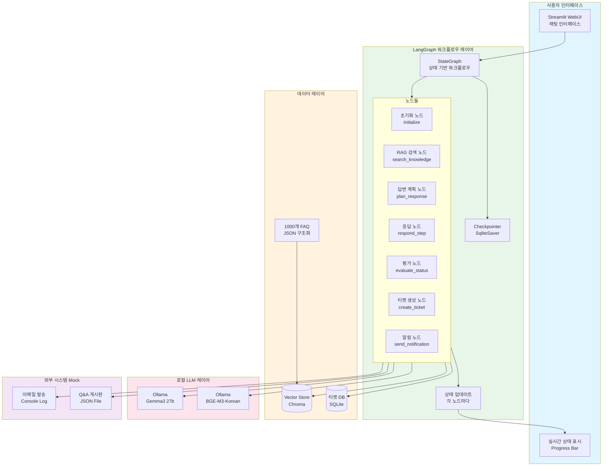
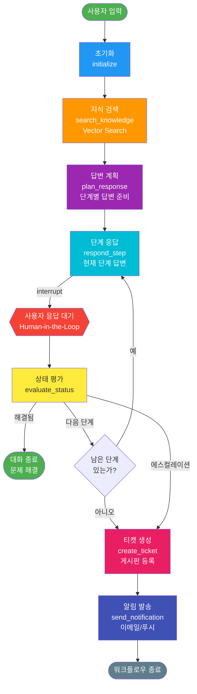

# 고객지원 챗봇 Agent - LangGraph PoC 상세 설계

## 📋 목차
1. [개요](#개요)
2. [PoC 범위 및 제약사항](#poc-범위-및-제약사항)
3. [시스템 아키텍처](#시스템-아키텍처)
4. [데이터 모델](#데이터-모델)
5. [LangGraph 워크플로우 설계](#langgraph-워크플로우-설계)
6. [주요 노드 상세 설계](#주요-노드-상세-설계)
7. [Human-in-the-Loop 구현](#human-in-the-loop-구현)
8. [기술 스택](#기술-스택)
9. [디렉토리 구조](#디렉토리-구조)
10. [구현 단계](#구현-단계)

---

## 개요

### 프로젝트 목표
FAQ와 Q&A 게시판 데이터를 기반으로 사용자 질의에 단계별(Step-by-Step)로 답변하고, 해결되지 않을 경우 자동으로 게시판에 등록하는 고객지원 챗봇 PoC 구축

### 핵심 기능
1. ✅ FAQ/Q&A 데이터 벡터화 및 검색
2. ✅ 단계별 문제 해결 가이드 제공
3. ✅ Human-in-the-Loop 방식 대화 진행
4. ✅ 미해결 시 자동 티켓 생성
5. ✅ 답변 등록 시 알림 발송

---

## PoC 범위 및 제약사항

### PoC에 포함되는 기능
- ✅ 로컬 LLM 기반 RAG (Ollama Gemma3 27b)
- ✅ 한글 최적화 임베딩 (Ollama BGE-M3-Korean)
- ✅ Chroma 벡터 스토어 (1000개 FAQ 지원)
- ✅ LangGraph StateGraph를 이용한 워크플로우
- ✅ FAQ 구조화된 데이터 (증상/원인/임시조치)
- ✅ 단계별 답변 제공 (최대 3단계)
- ✅ Human-in-the-Loop 인터럽트
- ✅ 실시간 진행 상태 표시
- ✅ **Streamlit WebUI** (채팅 인터페이스)
- ✅ 간단한 티켓 생성 (JSON 파일 저장)
- ✅ 이메일 알림 (콘솔 출력 시뮬레이션)

### PoC에서 제외되는 기능
- ❌ 실제 웹 크롤링 (1000개 샘플 FAQ 데이터 사용)
- ❌ 복잡한 GraphRAG (간단한 벡터 검색으로 대체)
- ❌ 프로덕션 데이터베이스 (SQLite 사용)
- ❌ 실제 게시판 API 연동 (Mock 구현)
- ❌ 인증/보안 기능

### 성공 기준
1. 사용자 질의에 대해 관련 FAQ 검색 성공률 > 70%
2. 3단계 이내 단계별 답변 제공
3. 대화 히스토리 유지 및 컨텍스트 이해
4. 미해결 시 티켓 자동 생성
5. 전체 워크플로우 정상 동작

---

## 시스템 아키텍처

### 전체 아키텍처 다이어그램



### LangGraph 워크플로우 상세도



---

## 데이터 모델

### 1. State 객체 (TypedDict)

```python
from typing import TypedDict, List, Dict, Literal, Optional
from langchain_core.messages import BaseMessage

class SupportState(TypedDict):
    """고객지원 챗봇의 전체 상태"""

    # 대화 관련
    messages: List[BaseMessage]              # 전체 대화 히스토리
    current_query: str                       # 현재 사용자 질의

    # RAG 검색 결과
    retrieved_docs: List[Dict]               # 검색된 FAQ 문서들
    relevance_score: float                   # 관련성 점수

    # 단계별 답변 계획
    solution_steps: List[Dict]               # 해결 단계 목록
    # 예: [
    #   {"step": 1, "action": "...", "description": "...", "completed": False},
    #   {"step": 2, "action": "...", "description": "...", "completed": False}
    # ]
    current_step: int                        # 현재 진행 중인 단계 (0부터 시작)
    max_steps: int                           # 최대 단계 수 (기본 3)

    # 상태 추적
    status: Literal[
        "initialized",      # 초기화됨
        "searching",        # 검색 중
        "planning",         # 답변 계획 중
        "responding",       # 응답 중
        "waiting_user",     # 사용자 응답 대기
        "evaluating",       # 평가 중
        "resolved",         # 해결됨
        "escalated",        # 에스컬레이션
        "ticket_created"    # 티켓 생성됨
    ]

    # 에스컬레이션 관련
    attempts: int                            # 시도 횟수
    unresolved_reason: Optional[str]         # 미해결 사유
    ticket_id: Optional[str]                 # 생성된 티켓 ID

    # 메타데이터
    user_id: str                             # 사용자 ID
    session_id: str                          # 세션 ID
    started_at: str                          # 시작 시간
```

### 2. FAQ 문서 구조

```python
class FAQSolution(TypedDict):
    """개별 해결 방법 구조"""
    method: int                              # 방법 번호 (1, 2, 3, ...)
    title: str                               # 방법 제목
    steps: List[str]                         # 실행 단계들
    expected_result: str                     # 기대되는 결과

class FAQContent(TypedDict):
    """FAQ 본문 구조 (증상/원인/임시조치)"""
    symptom: str                             # 증상 설명
    cause: str                               # 원인 설명
    solutions: List[FAQSolution]             # 임시조치 방법들 (방법1, 방법2, ...)

class FAQDocument(TypedDict):
    """FAQ 문서 구조 (1000개 게시글 기준)"""
    id: str                                  # 문서 ID (예: FAQ-001)
    category: str                            # 카테고리 (메신저, 로그인, 알림 등)
    title: str                               # 게시글 제목
    content: FAQContent                      # 본문 (증상/원인/임시조치)
    tags: List[str]                          # 태그
    created_at: str                          # 생성일
    updated_at: str                          # 수정일
    view_count: int                          # 조회수
    helpful_count: int                       # 도움됨 수
    source: Literal["faq", "qa_board"]       # 출처

# 예시 데이터
example_faq = {
    "id": "FAQ-001",
    "category": "메신저",
    "title": "신착 메시지 알림이 표시되지 않음",
    "content": {
        "symptom": "메신저에서 새로운 메시지를 받아도 알림창이 뜨지 않습니다.",
        "cause": "알림 설정이 비활성화되어 있거나, 운영체제의 알림 권한이 거부된 경우 발생할 수 있습니다.",
        "solutions": [
            {
                "method": 1,
                "title": "메신저 알림 설정 확인",
                "steps": [
                    "환경설정 메뉴를 엽니다",
                    "알림 탭을 선택합니다",
                    "'알림창' 옵션에 체크되어 있는지 확인합니다"
                ],
                "expected_result": "알림창에 체크가 되어있어야 합니다"
            },
            {
                "method": 2,
                "title": "윈도우 알림 설정 확인",
                "steps": [
                    "윈도우 시작 메뉴를 엽니다",
                    "설정 > 시스템 > 알림 및 작업을 선택합니다",
                    "'앱 및 다른 보낸 사람의 알림 받기'를 켜짐으로 설정합니다"
                ],
                "expected_result": "모든 알림 설정이 켜짐 상태여야 합니다"
            },
            {
                "method": 3,
                "title": "메신저 재시작",
                "steps": [
                    "작업 표시줄에서 메신저 아이콘을 우클릭합니다",
                    "'종료'를 선택합니다",
                    "메신저를 다시 실행합니다"
                ],
                "expected_result": "재시작 후 알림이 정상적으로 표시됩니다"
            }
        ]
    },
    "tags": ["알림", "메신저", "설정"],
    "created_at": "2023-08-15",
    "updated_at": "2023-11-10",
    "view_count": 1247,
    "helpful_count": 982,
    "source": "faq"
}
```

### 3. 티켓 구조

```python
class Ticket(TypedDict):
    """Q&A 게시판 티켓 구조"""
    ticket_id: str                           # 티켓 ID
    user_id: str                             # 사용자 ID
    title: str                               # 제목
    content: str                             # 내용 (대화 요약)
    conversation_history: List[Dict]         # 전체 대화 내역
    category: str                            # 카테고리
    status: Literal["open", "answered", "closed"]
    created_at: str                          # 생성 시간
    answered_at: Optional[str]               # 답변 시간
    answer: Optional[str]                    # 답변 내용
```

---

## LangGraph 워크플로우 설계

### StateGraph 구조

```python
from langgraph.graph import StateGraph, END
from langgraph.checkpoint.sqlite import SqliteSaver

# 체크포인터 생성 (대화 상태 저장)
memory = SqliteSaver.from_conn_string("checkpoints.db")

# StateGraph 생성
workflow = StateGraph(SupportState)

# 노드 추가
workflow.add_node("initialize", initialize_node)
workflow.add_node("search_knowledge", search_knowledge_node)
workflow.add_node("plan_response", plan_response_node)
workflow.add_node("respond_step", respond_step_node)
workflow.add_node("evaluate_status", evaluate_status_node)
workflow.add_node("create_ticket", create_ticket_node)
workflow.add_node("send_notification", send_notification_node)

# 엣지 정의
workflow.set_entry_point("initialize")
workflow.add_edge("initialize", "search_knowledge")
workflow.add_edge("search_knowledge", "plan_response")
workflow.add_edge("plan_response", "respond_step")

# respond_step 후 인터럽트 (사용자 응답 대기)
workflow.add_edge("respond_step", "evaluate_status")

# 조건부 라우팅
workflow.add_conditional_edges(
    "evaluate_status",
    route_next_action,  # 라우팅 함수
    {
        "continue": "respond_step",      # 다음 단계 계속
        "resolved": END,                 # 해결 완료
        "escalate": "create_ticket"      # 티켓 생성
    }
)

workflow.add_edge("create_ticket", "send_notification")
workflow.add_edge("send_notification", END)

# 컴파일
app = workflow.compile(checkpointer=memory)
```

### 라우팅 로직

```python
def route_next_action(state: SupportState) -> str:
    """다음 액션 결정"""

    # 해결됨으로 표시된 경우
    if state["status"] == "resolved":
        return "resolved"

    # 사용자가 명시적으로 티켓 요청
    last_message = state["messages"][-1].content.lower()
    if any(keyword in last_message for keyword in ["등록해", "문의해", "티켓"]):
        return "escalate"

    # 모든 단계를 시도했는데도 해결 안됨
    if state["current_step"] >= len(state["solution_steps"]):
        return "escalate"

    # 최대 시도 횟수 초과
    if state["attempts"] >= 5:
        return "escalate"

    # 다음 단계 계속
    return "continue"
```

---

## 주요 노드 상세 설계

### 1. Initialize Node (초기화)

```python
from datetime import datetime
import uuid

def initialize_node(state: SupportState) -> SupportState:
    """
    대화 초기화 노드
    - 세션 정보 설정
    - 초기 상태 설정
    """

    # 첫 실행시에만 초기화
    if "session_id" not in state or not state["session_id"]:
        state["session_id"] = str(uuid.uuid4())
        state["started_at"] = datetime.now().isoformat()
        state["attempts"] = 0
        state["current_step"] = 0
        state["max_steps"] = 3
        state["status"] = "initialized"

    # 현재 쿼리 추출 (마지막 사용자 메시지)
    if state["messages"]:
        last_msg = state["messages"][-1]
        if last_msg.type == "human":
            state["current_query"] = last_msg.content

    state["attempts"] += 1
    state["status"] = "searching"

    return state
```

### 2. Search Knowledge Node (지식 검색)

```python
from langchain_community.vectorstores import Chroma
from langchain_ollama import OllamaEmbeddings
from langchain_core.documents import Document

def search_knowledge_node(state: SupportState) -> SupportState:
    """
    RAG 검색 노드
    - 벡터 스토어에서 관련 FAQ 검색
    - 유사도 점수 계산
    """

    # 벡터 스토어 로드
    embeddings = OllamaEmbeddings(model="bge-m3-korean")
    vectorstore = Chroma(
        persist_directory="data/vectorstore",
        embedding_function=embeddings
    )

    # 유사 문서 검색 (상위 3개)
    query = state["current_query"]
    docs_with_scores = vectorstore.similarity_search_with_score(
        query,
        k=3
    )

    # 검색 결과 저장
    retrieved_docs = []
    for doc, score in docs_with_scores:
        retrieved_docs.append({
            "id": doc.metadata.get("id", ""),
            "category": doc.metadata.get("category", ""),
            "question": doc.metadata.get("question", ""),
            "answer": doc.page_content,
            "steps": doc.metadata.get("steps", []),
            "score": float(score),
            "source": doc.metadata.get("source", "faq")
        })

    state["retrieved_docs"] = retrieved_docs

    # 최고 점수 저장 (낮을수록 좋음 - 코사인 거리)
    state["relevance_score"] = docs_with_scores[0][1] if docs_with_scores else 1.0
    state["status"] = "planning"

    return state
```

### 3. Plan Response Node (답변 계획)

```python
from langchain_ollama import ChatOllama
from langchain_core.prompts import ChatPromptTemplate
import json

def plan_response_node(state: SupportState) -> SupportState:
    """
    답변 계획 노드
    - 검색된 문서를 바탕으로 단계별 해결 방법 생성
    - LLM을 활용한 계획 수립
    """

    llm = ChatOllama(model="gemma2:27b", temperature=0)

    # 검색된 문서들 포맷팅
    docs_context = "\n\n".join([
        f"[문서 {i+1}] (관련도: {doc['score']:.3f})\n"
        f"질문: {doc['question']}\n"
        f"답변: {doc['answer']}\n"
        f"단계: {json.dumps(doc.get('steps', []), ensure_ascii=False)}"
        for i, doc in enumerate(state["retrieved_docs"])
    ])

    prompt = ChatPromptTemplate.from_messages([
        ("system", """당신은 고객지원 전문가입니다.
사용자의 문제를 해결하기 위한 단계별 가이드를 작성하세요.

검색된 관련 문서:
{docs_context}

다음 JSON 형식으로 응답하세요:
{{
  "steps": [
    {{
      "step": 1,
      "action": "확인할 항목 또는 수행할 작업",
      "description": "상세 설명",
      "expected_result": "기대되는 결과"
    }},
    ...
  ],
  "estimated_difficulty": "easy|medium|hard"
}}

최대 3단계까지만 작성하세요."""),
        ("user", "사용자 문제: {query}")
    ])

    # LLM 호출
    response = llm.invoke(
        prompt.format_messages(
            docs_context=docs_context,
            query=state["current_query"]
        )
    )

    # JSON 파싱
    try:
        plan = json.loads(response.content)
        state["solution_steps"] = plan["steps"]

        # 각 단계에 완료 여부 추가
        for step in state["solution_steps"]:
            step["completed"] = False

    except json.JSONDecodeError:
        # 파싱 실패시 기본 단계 생성
        state["solution_steps"] = [{
            "step": 1,
            "action": "기본 확인 사항",
            "description": state["retrieved_docs"][0]["answer"] if state["retrieved_docs"] else "관련 정보를 찾을 수 없습니다.",
            "expected_result": "문제 해결",
            "completed": False
        }]

    state["current_step"] = 0
    state["status"] = "responding"

    return state
```

### 4. Respond Step Node (단계별 응답)

```python
from langchain_core.messages import AIMessage

def respond_step_node(state: SupportState) -> SupportState:
    """
    현재 단계의 답변 제공
    - 사용자에게 현재 단계 안내
    - Human-in-the-Loop을 위한 응답 생성
    """

    current_idx = state["current_step"]
    steps = state["solution_steps"]

    # 현재 단계가 없으면 에스컬레이션
    if current_idx >= len(steps):
        state["status"] = "escalated"
        state["unresolved_reason"] = "모든 단계를 시도했으나 해결되지 않음"

        response_text = (
            "불편을 드려 죄송합니다. 담당 부서의 확인이 필요한 상황인 것 같습니다.\n"
            "현재까지의 문의 내용으로 문의를 등록하시겠습니까?"
        )
    else:
        current_step = steps[current_idx]
        step_num = current_step["step"]
        total_steps = len(steps)

        response_text = (
            f"**[단계 {step_num}/{total_steps}]** {current_step['action']}\n\n"
            f"{current_step['description']}\n\n"
            f"📌 기대 결과: {current_step['expected_result']}\n\n"
            f"이 단계를 확인하셨나요? 결과를 알려주세요."
        )

    # 응답 메시지 추가
    state["messages"].append(AIMessage(content=response_text))
    state["status"] = "waiting_user"

    return state
```

### 5. Evaluate Status Node (상태 평가)

```python
from langchain_ollama import ChatOllama
from langchain_core.prompts import ChatPromptTemplate

def evaluate_status_node(state: SupportState) -> SupportState:
    """
    사용자 응답 평가
    - 문제가 해결되었는지 판단
    - 다음 단계로 진행할지 결정
    """

    llm = ChatOllama(model="gemma2:27b", temperature=0)

    # 마지막 사용자 응답 가져오기
    last_user_message = ""
    for msg in reversed(state["messages"]):
        if msg.type == "human":
            last_user_message = msg.content
            break

    # 현재 단계 정보
    current_idx = state["current_step"]
    current_step = state["solution_steps"][current_idx] if current_idx < len(state["solution_steps"]) else None

    prompt = ChatPromptTemplate.from_messages([
        ("system", """당신은 고객지원 대화를 분석하는 전문가입니다.
사용자의 응답을 분석하여 다음 중 하나를 판단하세요:

1. "resolved": 문제가 해결됨
2. "continue": 현재 단계가 효과 없음, 다음 단계 필요
3. "escalate": 사용자가 명시적으로 문의 등록 요청

판단 기준:
- "해결됐어요", "됐어요", "감사합니다" 등 → resolved
- "안돼요", "여전히", "체크되어 있는데" 등 → continue
- "등록해주세요", "문의할게요" 등 → escalate

JSON 형식으로 응답:
{{"decision": "resolved|continue|escalate", "reason": "판단 이유"}}"""),
        ("user", """현재 단계: {current_step}
사용자 응답: {user_response}""")
    ])

    response = llm.invoke(
        prompt.format_messages(
            current_step=str(current_step),
            user_response=last_user_message
        )
    )

    try:
        evaluation = json.loads(response.content)
        decision = evaluation["decision"]

        if decision == "resolved":
            state["status"] = "resolved"
            state["messages"].append(
                AIMessage(content="문제가 해결되어 기쁩니다! 추가로 도움이 필요하시면 언제든 문의해주세요.")
            )
        elif decision == "escalate":
            state["status"] = "escalated"
            state["unresolved_reason"] = evaluation["reason"]
        else:  # continue
            # 현재 단계를 완료로 표시하고 다음 단계로
            if current_step:
                current_step["completed"] = True
            state["current_step"] += 1
            state["status"] = "responding"

    except json.JSONDecodeError:
        # 기본 동작: 다음 단계로
        state["current_step"] += 1
        state["status"] = "responding"

    return state
```

### 6. Create Ticket Node (티켓 생성)

```python
import json
from datetime import datetime
import uuid

def create_ticket_node(state: SupportState) -> SupportState:
    """
    티켓 생성 노드
    - 대화 내용 요약
    - Q&A 게시판에 등록 (PoC: JSON 파일 저장)
    """

    llm = ChatOllama(model="gemma2:27b", temperature=0)

    # 대화 내용 포맷팅
    conversation = "\n".join([
        f"{'사용자' if msg.type == 'human' else 'Agent'}: {msg.content}"
        for msg in state["messages"]
    ])

    # 요약 생성
    summary_prompt = ChatPromptTemplate.from_messages([
        ("system", """대화 내용을 요약하여 Q&A 게시판 제목과 본문을 작성하세요.

JSON 형식으로 응답:
{{
  "title": "간결한 제목 (20자 이내)",
  "summary": "문제 상황 요약 (100자 이내)",
  "attempted_solutions": ["시도한 해결방법 1", "시도한 해결방법 2", ...]
}}"""),
        ("user", "대화 내용:\n{conversation}")
    ])

    response = llm.invoke(
        summary_prompt.format_messages(conversation=conversation)
    )

    try:
        summary = json.loads(response.content)
    except json.JSONDecodeError:
        summary = {
            "title": "고객 문의",
            "summary": state["current_query"],
            "attempted_solutions": []
        }

    # 티켓 생성
    ticket = {
        "ticket_id": str(uuid.uuid4())[:8],
        "user_id": state.get("user_id", "anonymous"),
        "session_id": state["session_id"],
        "title": summary["title"],
        "summary": summary["summary"],
        "attempted_solutions": summary["attempted_solutions"],
        "conversation_history": [
            {"role": msg.type, "content": msg.content, "timestamp": datetime.now().isoformat()}
            for msg in state["messages"]
        ],
        "category": state["retrieved_docs"][0]["category"] if state["retrieved_docs"] else "기타",
        "status": "open",
        "created_at": datetime.now().isoformat(),
        "answered_at": None,
        "answer": None
    }

    # 파일로 저장 (PoC)
    ticket_file = f"data/tickets/ticket_{ticket['ticket_id']}.json"
    with open(ticket_file, "w", encoding="utf-8") as f:
        json.dump(ticket, f, ensure_ascii=False, indent=2)

    state["ticket_id"] = ticket["ticket_id"]
    state["status"] = "ticket_created"

    # 사용자에게 안내
    state["messages"].append(
        AIMessage(content=f"""아래 내용으로 문의를 등록하였습니다.

**문의 번호**: {ticket['ticket_id']}
**제목**: {ticket['title']}
**요약**: {ticket['summary']}

답변이 등록되면 이메일로 알려드리겠습니다.""")
    )

    return state
```

### 7. Send Notification Node (알림 발송)

```python
def send_notification_node(state: SupportState) -> SupportState:
    """
    알림 발송 노드
    - 이메일 알림 (PoC: 콘솔 출력)
    - 푸시 알림 시뮬레이션
    """

    ticket_id = state.get("ticket_id", "N/A")
    user_id = state.get("user_id", "anonymous")

    # 이메일 내용 생성
    email_content = f"""
안녕하세요,

문의가 정상적으로 등록되었습니다.

문의번호: {ticket_id}
등록시간: {datetime.now().strftime('%Y-%m-%d %H:%M:%S')}

담당자가 확인 후 답변을 드리겠습니다.
답변이 등록되면 다시 알림을 보내드립니다.

감사합니다.
    """

    # PoC: 콘솔 출력
    print("\n" + "="*50)
    print("📧 이메일 발송 시뮬레이션")
    print("="*50)
    print(f"To: user_{user_id}@example.com")
    print(f"Subject: [고객지원] 문의가 등록되었습니다 (#{ticket_id})")
    print(email_content)
    print("="*50 + "\n")

    # 실제 프로덕션에서는:
    # send_email(
    #     to=user_email,
    #     subject=f"[고객지원] 문의가 등록되었습니다 (#{ticket_id})",
    #     body=email_content
    # )

    return state
```

---

## Human-in-the-Loop 구현

### Interrupt 사용

LangGraph는 특정 노드 전후에 `interrupt` 기능을 제공합니다.

```python
from langgraph.graph import StateGraph

# 컴파일 시 interrupt 설정
app = workflow.compile(
    checkpointer=memory,
    interrupt_before=["evaluate_status"]  # 평가 전에 사용자 입력 대기
)
```

### 실행 흐름

```python
from langchain_core.messages import HumanMessage

# 설정
config = {
    "configurable": {
        "thread_id": "user_session_123"  # 대화 스레드 ID
    }
}

# 1. 첫 질의
initial_input = {
    "messages": [HumanMessage(content="메신저에서 신착 메시지 알림이 안떠요")],
    "user_id": "user_001"
}

# 워크플로우 실행 (interrupt까지)
for event in app.stream(initial_input, config):
    print(event)

# 2. 사용자 응답 후 재개
user_response = {
    "messages": [HumanMessage(content="체크되어 있는데요")]
}

# 이전 상태에서 계속
for event in app.stream(user_response, config):
    print(event)

# 3. 계속 진행
user_response_2 = {
    "messages": [HumanMessage(content="그것도 켬으로 되어 있어요")]
}

for event in app.stream(user_response_2, config):
    print(event)

# 4. 티켓 등록 요청
user_response_3 = {
    "messages": [HumanMessage(content="네 등록해주세요")]
}

for event in app.stream(user_response_3, config):
    print(event)
```

### 상태 확인 및 복원

```python
# 현재 상태 확인
current_state = app.get_state(config)
print(f"현재 상태: {current_state.values['status']}")
print(f"현재 단계: {current_state.values['current_step']}")

# 특정 시점으로 되돌리기 (Time Travel)
history = app.get_state_history(config)
for state in history:
    print(f"시점: {state.config['configurable']['checkpoint_id']}")
    print(f"상태: {state.values['status']}")
```

---

## 기술 스택

### 핵심 라이브러리

```python
# requirements.txt

# LangChain 및 LangGraph
langchain==0.1.0
langchain-core==0.1.0
langchain-community==0.0.13
langgraph==0.0.20

# Ollama (로컬 LLM)
langchain-ollama==0.1.0
ollama==0.1.6

# 벡터 스토어
chromadb==0.4.22

# Streamlit WebUI
streamlit==1.28.0
streamlit-chat==0.1.1

# 데이터 처리
pandas==2.1.4
numpy==1.26.2

# 유틸리티
python-dotenv==1.0.0
pydantic==2.5.3

# 개발 도구
jupyter==1.0.0
pytest==7.4.3
```

### Ollama 모델 설치

```bash
# Ollama 설치 (https://ollama.ai)
# macOS/Linux
curl -fsSL https://ollama.ai/install.sh | sh

# Windows
# https://ollama.ai/download 에서 다운로드

# 필요한 모델 다운로드
ollama pull gemma2:27b          # LLM 모델
ollama pull bge-m3-korean       # 한글 임베딩 모델 (1.2GB)

# 모델 확인
ollama list
```

### 환경 변수 (.env)

```bash
# Ollama 설정
OLLAMA_BASE_URL=http://localhost:11434
OLLAMA_LLM_MODEL=gemma2:27b
OLLAMA_EMBEDDING_MODEL=bge-m3-korean

# 데이터 경로
DATA_DIR=./data
VECTORSTORE_PATH=./data/vectorstore
TICKETS_PATH=./data/tickets

# Streamlit 설정
STREAMLIT_SERVER_PORT=8501
STREAMLIT_SERVER_ADDRESS=localhost

# 로깅
LOG_LEVEL=INFO
```

---

## 디렉토리 구조

```
customer-support-chatbot-poc/
├── README.md                       # 프로젝트 개요
├── requirements.txt                # Python 의존성
├── .env                            # 환경 변수
├── .gitignore
│
├── docs/                           # 문서
│   ├── customer-support-chatbot-langgraph-design.md
│   ├── microsoft-agent-framework-detailed.md
│   └── user-scenario-workflow.md  # 사용자 시나리오
│
├── data/                           # 데이터 디렉토리
│   ├── faq_1000.json              # 1000개 FAQ 데이터
│   ├── vectorstore/               # Chroma 벡터 스토어
│   │   └── chroma.sqlite3
│   └── tickets/                   # 생성된 티켓들
│       └── ticket_*.json
│
├── src/                           # 소스 코드
│   ├── __init__.py
│   │
│   ├── models/                    # 데이터 모델
│   │   ├── __init__.py
│   │   ├── state.py              # State 정의
│   │   ├── faq.py                # FAQ 모델 (증상/원인/임시조치)
│   │   └── ticket.py             # Ticket 모델
│   │
│   ├── nodes/                     # LangGraph 노드
│   │   ├── __init__.py
│   │   ├── initialize.py         # 초기화 노드
│   │   ├── search_knowledge.py   # 검색 노드
│   │   ├── plan_response.py      # 계획 노드
│   │   ├── respond_step.py       # 응답 노드
│   │   ├── evaluate_status.py    # 평가 노드
│   │   ├── create_ticket.py      # 티켓 생성
│   │   └── send_notification.py  # 알림 발송
│   │
│   ├── graph/                     # 그래프 구성
│   │   ├── __init__.py
│   │   ├── workflow.py           # 워크플로우 정의
│   │   └── routing.py            # 라우팅 로직
│   │
│   ├── services/                  # 서비스 레이어
│   │   ├── __init__.py
│   │   ├── vectorstore.py        # Chroma 벡터 스토어 관리
│   │   ├── ollama_service.py     # Ollama LLM 호출
│   │   ├── ticket_service.py     # 티켓 관리
│   │   └── status_service.py     # 진행 상태 관리
│   │
│   ├── ui/                        # Streamlit WebUI
│   │   ├── __init__.py
│   │   ├── app.py                # 메인 Streamlit 앱
│   │   ├── components/           # UI 컴포넌트
│   │   │   ├── chat_interface.py # 채팅 인터페이스
│   │   │   ├── status_display.py # 상태 표시
│   │   │   └── ticket_view.py    # 티켓 뷰
│   │   └── styles.py             # CSS 스타일
│   │
│   └── utils/                     # 유틸리티
│       ├── __init__.py
│       ├── logger.py             # 로깅 설정
│       └── config.py             # 설정 관리
│
├── scripts/                       # 스크립트
│   ├── prepare_faq_data.py       # FAQ 1000개 데이터 준비
│   ├── build_vectorstore.py      # Chroma 벡터 스토어 구축
│   └── test_ollama.py            # Ollama 연결 테스트
│
├── notebooks/                     # Jupyter 노트북
│   ├── 01_data_exploration.ipynb
│   ├── 02_vectorstore_test.ipynb
│   └── 03_workflow_test.ipynb
│
├── tests/                         # 테스트
│   ├── __init__.py
│   ├── test_nodes.py
│   ├── test_workflow.py
│   └── test_integration.py
│
├── checkpoints.db                 # SQLite 체크포인트
└── main.py                        # CLI 실행 파일
```

---

## 구현 단계

### Phase 1: 환경 설정 및 데이터 준비 (1일)

**Task 1.1: 프로젝트 초기화**
```bash
# 가상환경 생성
python -m venv venv
source venv/bin/activate  # Windows: venv\Scripts\activate

# 의존성 설치
pip install -r requirements.txt

# 디렉토리 생성
mkdir -p data/{vectorstore,tickets}
mkdir -p src/{models,nodes,graph,services,utils}
```

**Task 1.2: 샘플 데이터 생성**
- FAQ 데이터 20-30개 작성 (JSON)
- Q&A 게시판 데이터 10-15개 작성
- 카테고리: 메신저, 로그인, 알림, 네트워크 등

**Task 1.3: 벡터 스토어 구축**
```bash
python scripts/build_vectorstore.py
```

### Phase 2: 모델 및 노드 구현 (2-3일)

**Task 2.1: 데이터 모델 정의**
- `src/models/state.py` - SupportState
- `src/models/faq.py` - FAQDocument
- `src/models/ticket.py` - Ticket

**Task 2.2: 노드 구현**
- 각 노드별 구현 (7개 노드)
- 단위 테스트 작성

**Task 2.3: 서비스 레이어 구현**
- VectorStore 관리
- LLM 호출 래퍼
- 티켓 CRUD

### Phase 3: 워크플로우 구성 (2일)

**Task 3.1: StateGraph 구성**
- 노드 연결
- 엣지 정의
- 라우팅 로직

**Task 3.2: Checkpointer 설정**
- SQLite 기반 상태 저장
- Thread 관리

### Phase 4: CLI 인터페이스 (1일)

**Task 4.1: main.py 구현**
- 대화형 CLI
- 상태 출력
- 디버깅 모드

### Phase 5: 테스트 및 검증 (1-2일)

**Task 5.1: 통합 테스트**
- 전체 시나리오 테스트
- 엣지 케이스 검증

**Task 5.2: 성능 측정**
- 검색 정확도
- 응답 시간
- 사용자 경험

### 총 예상 기간: 7-9일

---

## 다음 단계

이 설계 문서를 바탕으로 다음 작업을 진행할 수 있습니다:

1. ✅ **샘플 데이터 생성**: FAQ/Q&A JSON 파일 작성
2. ✅ **프로젝트 스캐폴딩**: 디렉토리 구조 및 기본 파일 생성
3. ✅ **핵심 노드 구현**: 7개 노드 코드 작성
4. ✅ **워크플로우 통합**: LangGraph 구성
5. ✅ **CLI 실행**: 실제 대화 테스트

어떤 부분부터 구현을 시작하시겠습니까?
