# Microsoft Agent Framework 상세 가이드

## 목차
1. [개요](#개요)
2. [핵심 개념](#핵심-개념)
3. [아키텍처](#아키텍처)
4. [주요 구성 요소](#주요-구성-요소)
5. [워크플로우 패턴](#워크플로우-패턴)
6. [시퀀스 다이어그램](#시퀀스-다이어그램)
7. [AutoGen과의 비교](#autogen과의-비교)
8. [설치 및 시작하기](#설치-및-시작하기)
9. [실전 예제](#실전-예제)
10. [마이그레이션 가이드](#마이그레이션-가이드)

---

## 개요

### Microsoft Agent Framework란?

Microsoft Agent Framework는 2025년 10월에 공개 프리뷰로 발표된 오픈소스 AI 에이전트 개발 프레임워크입니다. .NET과 Python을 모두 지원하며, 단일 에이전트부터 복잡한 멀티 에이전트 워크플로우까지 구축할 수 있습니다.

**핵심 특징:**
- **통합 프레임워크**: Semantic Kernel과 AutoGen을 하나로 통합
- **다중 언어 지원**: Python과 .NET(C#) 완전 지원
- **엔터프라이즈 준비**: 관찰성, 내구성, 컴플라이언스 내장
- **유연한 오케스트레이션**: 에이전트 오케스트레이션과 워크플로우 오케스트레이션 모두 지원
- **개방형 생태계**: MCP(Model Context Protocol), A2A(Agent2Agent) 지원

### 왜 등장했는가?

**기존의 문제:**
- Semantic Kernel: 엔터프라이즈급 기능은 우수하나 실험적 멀티 에이전트 패턴 부족
- AutoGen: 혁신적인 멀티 에이전트 오케스트레이션이지만 프로덕션 준비 기능 부족
- 개발자들은 둘 중 하나를 선택해야 하는 딜레마

**해결책:**
Microsoft Agent Framework는 두 프로젝트의 장점을 결합하여 실험부터 프로덕션까지 하나의 통합된 플랫폼을 제공합니다.

---

## 핵심 개념

### 1. AI Agent

AI 에이전트는 LLM을 사용하여 사용자 입력을 처리하고, 도구를 호출하고, 응답을 생성하는 자율적인 소프트웨어 컴포넌트입니다.

**구성 요소:**
- **LLM 모델**: 자연어 이해 및 생성
- **도구/함수**: 외부 API 호출 및 작업 수행
- **메모리**: 대화 상태 관리
- **미들웨어**: 요청/응답 처리 파이프라인

### 2. Workflow

워크플로우는 여러 에이전트와 함수를 연결하여 복잡한 다단계 작업을 수행하는 그래프 기반 구조입니다.

**특징:**
- 명시적 실행 경로 정의
- 타입 안전성
- 체크포인팅 (상태 저장/복원)
- Human-in-the-loop 지원
- 조건부 라우팅

---

## 아키텍처

### 전체 시스템 아키텍처

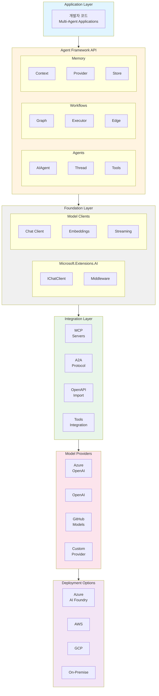

### AI Agent 내부 구조

```mermaid
graph TB
    subgraph Agent["AI Agent"]
        subgraph Config["Agent Configuration"]
            Name[Name]
            Instructions[Instructions<br/>System Prompt]
            Model[Model Selection]
            Params[Temperature<br/>Max Tokens]
        end
        
        subgraph Input["Input Processing"]
            UserInput[User Input]
            ThreadMgr[Thread Manager]
            MiddlewarePipe[Middleware Pipeline]
            
            UserInput --> ThreadMgr
            ThreadMgr --> MiddlewarePipe
        end
        
        subgraph LLM["LLM Interaction"]
            ModelClient[Model Client<br/>IChatClient]
            AzureOAI[Azure OpenAI]
            OpenAIAPI[OpenAI]
            OtherProviders[Other Providers]
            
            ModelClient --> AzureOAI
            ModelClient --> OpenAIAPI
            ModelClient --> OtherProviders
        end
        
        subgraph ToolExec["Tool/Function Execution"]
            MCPServers[MCP Servers]
            CustomFunc[Custom Functions]
            OpenAPITools[OpenAPI APIs]
        end
        
        subgraph ContextMem["Context & Memory"]
            ContextProvider[Context Provider]
            ConvHistory[Conversation History]
            AgentState[Agent State]
            VectorStore[Vector Store<br/>RAG]
            
            ContextProvider --> ConvHistory
            ContextProvider --> AgentState
            ContextProvider --> VectorStore
        end
        
        subgraph Response["Response Generation"]
            StructuredOut[Structured Output]
            StreamSupport[Streaming Support]
            ErrorHandling[Error Handling]
        end
        
        Config --> Input
        Input --> LLM
        LLM --> ToolExec
        ToolExec --> ContextMem
        ContextMem --> Response
    end
    
    style Config fill:#e3f2fd
    style Input fill:#f3e5f5
    style LLM fill:#fff3e0
    style ToolExec fill:#e8f5e9
    style ContextMem fill:#fce4ec
    style Response fill:#f1f8e9
```

### Workflow 구조

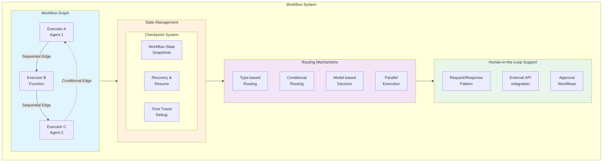

---

## 주요 구성 요소

### 1. AIAgent 추상화

가장 핵심적인 추상화로, 모든 에이전트는 이 인터페이스를 구현합니다.

**주요 기능:**
- 통일된 에이전트 인터페이스
- 다양한 모델 프로바이더 지원
- 도구 통합
- 스트리밍 지원

**코드 예제:**
```python
# Python
from agent_framework.azure import AzureOpenAIResponsesClient
from azure.identity import AzureCliCredential

agent = AzureOpenAIResponsesClient(
    credential=AzureCliCredential()
).create_agent(
    name="MyAgent",
    instructions="You are a helpful assistant.",
)

response = await agent.run("Hello, world!")
```

```csharp
// C#
using Microsoft.Agents.AI;
using Azure.AI.OpenAI;
using Azure.Identity;

var agent = new AzureOpenAIClient(
    new Uri(endpoint), 
    new AzureCliCredential()
)
.GetOpenAIResponseClient(deploymentName)
.CreateAIAgent(
    name: "MyAgent", 
    instructions: "You are a helpful assistant."
);

var response = await agent.RunAsync("Hello, world!");
```

### 2. Thread (스레드)

대화 상태를 관리하는 핵심 컴포넌트입니다.

**특징:**
- 멀티턴 대화 지원
- 컨텍스트 유지
- 메시지 히스토리 관리

### 3. Context Provider

에이전트 메모리를 제공하는 컴포넌트입니다.

**지원 스토어:**
- Redis
- Pinecone
- Qdrant
- Weaviate
- Elasticsearch
- PostgreSQL
- Custom Store

### 4. Middleware

요청/응답 파이프라인을 가로채고 처리하는 시스템입니다.

**용도:**
- 로깅 및 모니터링
- 에러 핸들링
- 보안 검증
- 커스텀 처리 로직

### 5. Model Context Protocol (MCP)

외부 도구와 데이터 서버를 동적으로 연결하는 프로토콜입니다.

**장점:**
- 동적 도구 발견
- 표준화된 통신
- 확장성

### 6. Agent2Agent (A2A)

에이전트 간 협업을 위한 프로토콜입니다.

**기능:**
- 런타임 간 협업
- 구조화된 메시징
- 크로스 플랫폼 지원

---

## 워크플로우 패턴

### 1. Sequential (순차) 패턴

에이전트들이 순서대로 실행되며, 각 에이전트의 출력이 다음 에이전트의 입력이 됩니다.

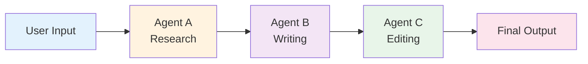

**사용 사례:**
- 콘텐츠 생성 파이프라인
- 데이터 처리 워크플로우
- 순차적 의사결정

### 2. Concurrent (병렬) 패턴

여러 에이전트가 동시에 작업을 수행합니다.

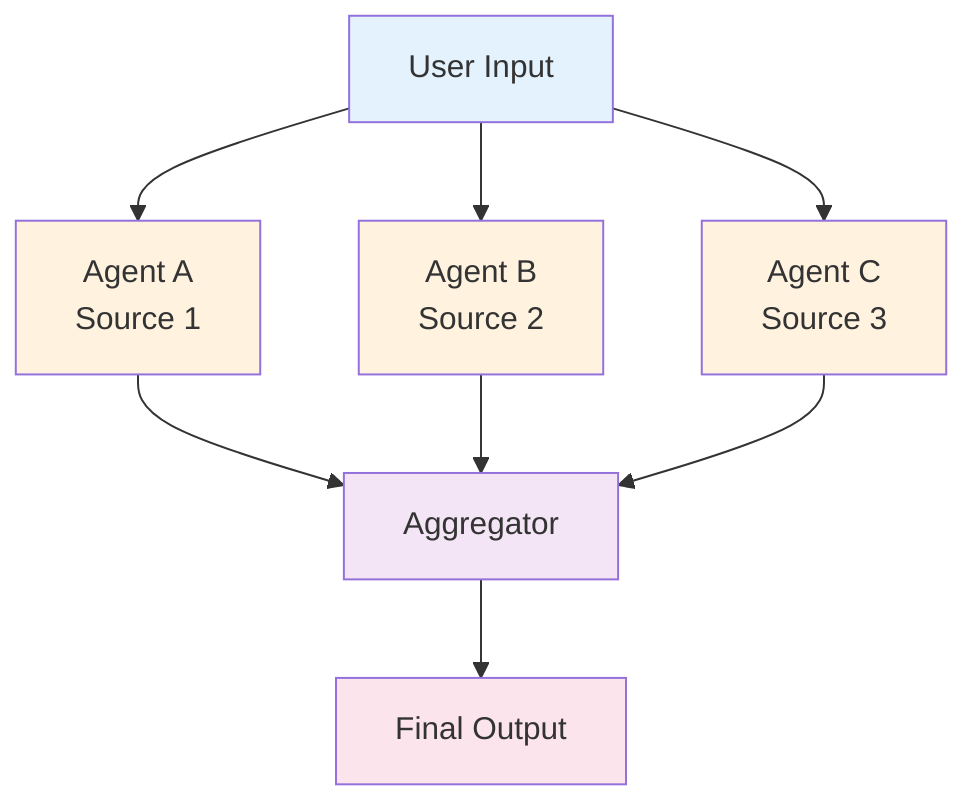

**사용 사례:**
- 멀티소스 리서치
- 병렬 데이터 분석
- 성능 최적화가 필요한 작업

### 3. Handoff (핸드오프) 패턴

컨텍스트나 결과에 따라 에이전트 간 책임이 이전됩니다.

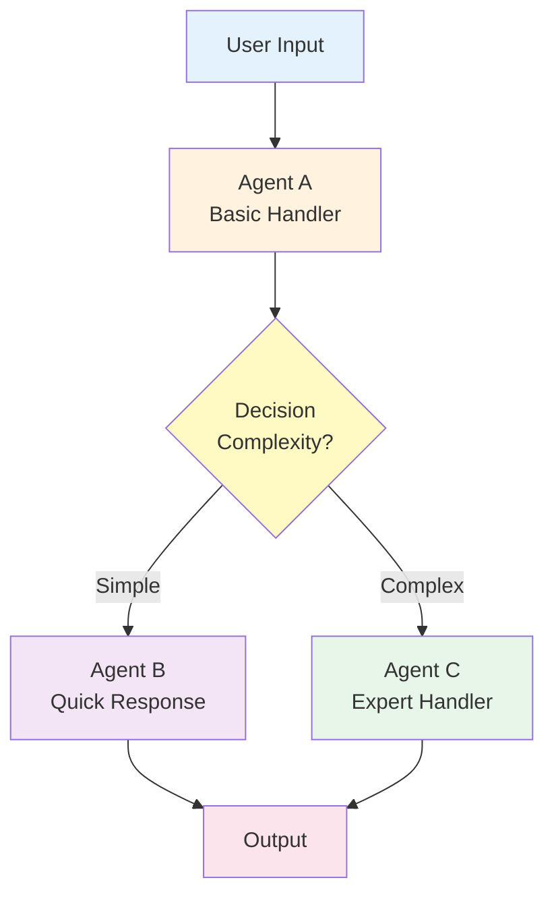

**사용 사례:**
- 고객 지원 에스컬레이션
- 동적 작업 라우팅
- 전문화된 에이전트 시스템

### 4. Group Chat (그룹 채팅) 패턴

여러 에이전트가 실시간으로 협업하는 대화형 공간입니다.

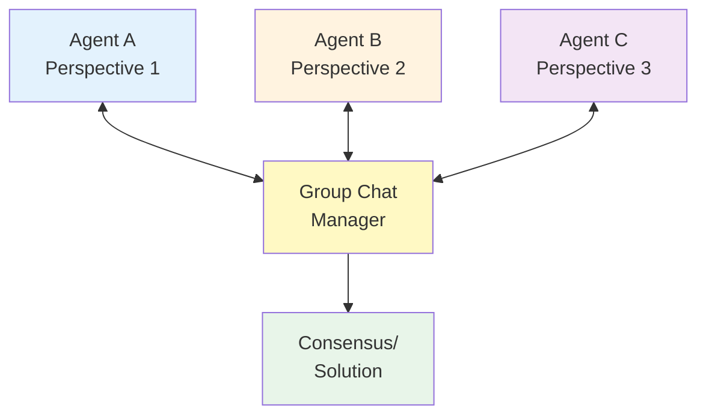

**사용 사례:**
- 협업 문제 해결
- 의사결정 시스템
- 멀티 에이전트 토론

### 5. Magentic One 패턴

Microsoft에서 개발한 고급 멀티 에이전트 오케스트레이션 패턴입니다.

**구성:**
- Orchestrator: 전체 작업 조정
- Web Surfer: 웹 정보 수집
- File Surfer: 파일 처리
- Coder: 코드 생성 및 실행
- Computer Terminal: 시스템 명령 실행

---

## 시퀀스 다이어그램

### 기본 Agent 실행 흐름

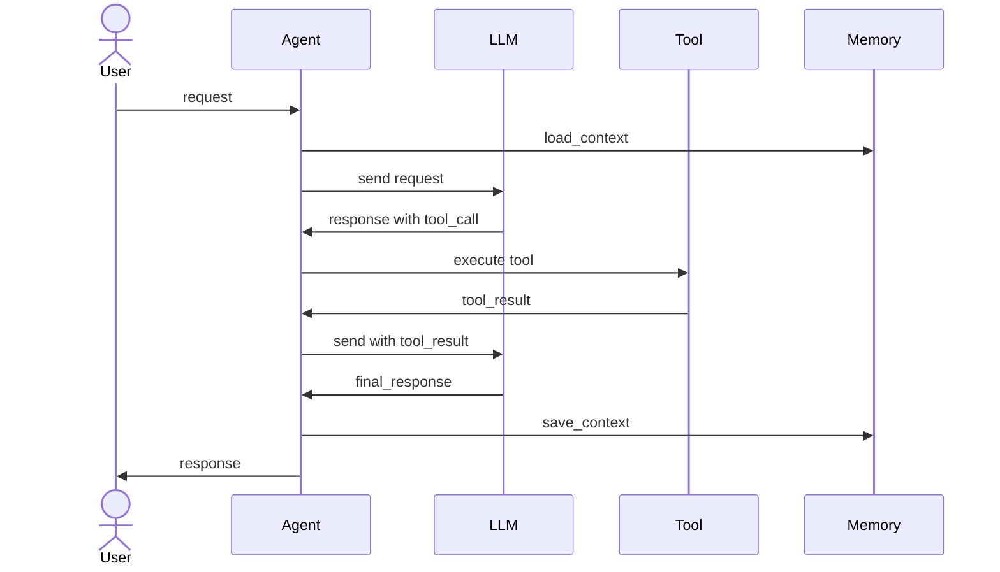

### Workflow 실행 흐름

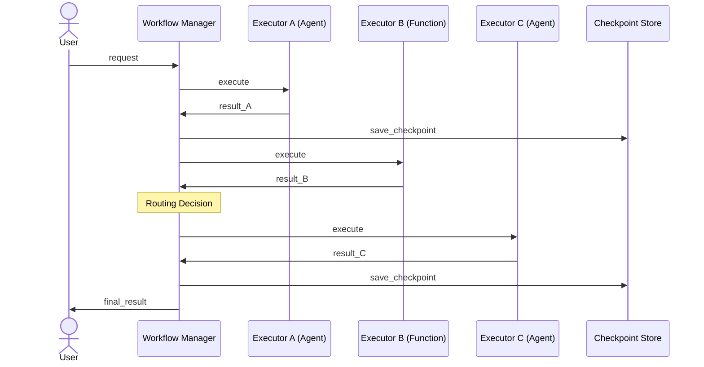

### Human-in-the-Loop 워크플로우

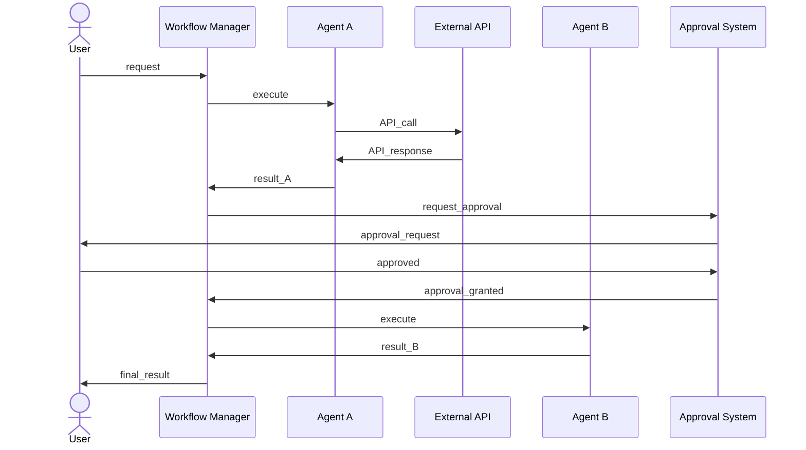

### MCP 통합 시퀀스

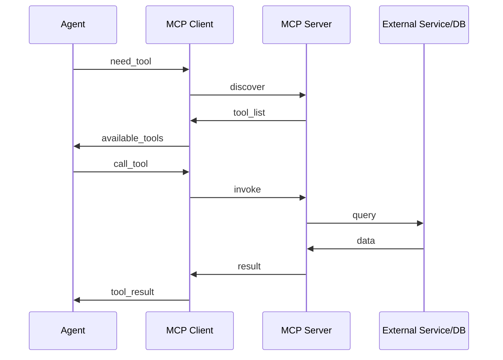

---

## AutoGen과의 비교

### 전반적 비교

| 특징 | AutoGen | Agent Framework | 설명 |
|------|---------|-----------------|------|
| **개발 주체** | Microsoft Research → 오픈소스 | Microsoft (Semantic Kernel + AutoGen 팀) | AF는 두 팀의 통합 결과물 |
| **초점** | 실험적 멀티 에이전트 연구 | 엔터프라이즈 프로덕션 | AF는 프로덕션 준비가 핵심 |
| **아키텍처** | Actor 모델 기반 | 레이어드 아키텍처 | AF는 더 구조화된 설계 |
| **상태 관리** | 메시지 기반 | Thread 기반 + Checkpoint | AF가 더 강력한 상태 관리 |
| **타입 안전성** | 제한적 | 강력한 타입 시스템 | AF는 컴파일 타임 검증 |

### 아키텍처 비교

#### AutoGen 아키텍처

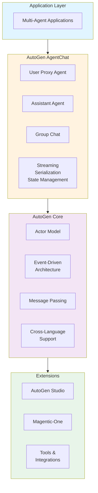

**특징:**
- **Actor Model**: 각 에이전트는 독립적인 액터로 동작
- **이벤트 기반**: 비동기 메시지 패싱
- **유연성**: 동적 워크플로우에 강점
- **실험성**: 빠른 프로토타이핑에 적합

#### Agent Framework 아키텍처

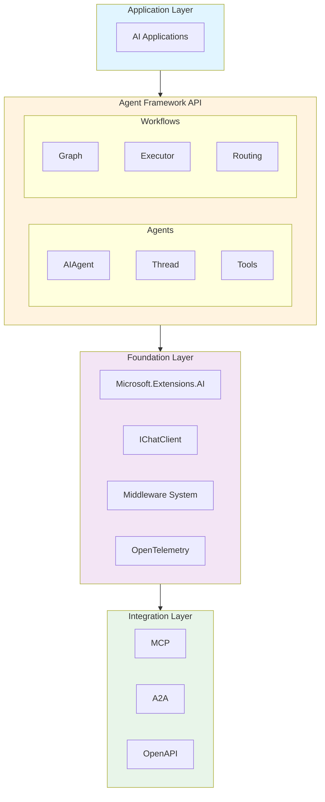

**특징:**
- **레이어드**: 명확한 계층 구조
- **타입 안전**: 강력한 타입 시스템
- **엔터프라이즈**: 관찰성, 컴플라이언스 내장
- **통합**: Semantic Kernel의 안정성 + AutoGen의 혁신

### 오케스트레이션 비교

| 측면 | AutoGen | Agent Framework |
|------|---------|-----------------|
| **접근 방식** | LLM 기반 동적 오케스트레이션 | 워크플로우 + 에이전트 오케스트레이션 |
| **제어 수준** | 낮음 (에이전트가 결정) | 높음 (명시적 그래프 정의) |
| **예측 가능성** | 낮음 | 높음 |
| **유연성** | 매우 높음 | 높음 |
| **적합 시나리오** | 탐색적, 창의적 작업 | 비즈니스 프로세스, 프로덕션 |

### 멀티 에이전트 패턴 비교

#### AutoGen 그룹 채팅

```python
# AutoGen Group Chat
import autogen

config_list = [{"model": "gpt-4", "api_key": "..."}]

user_proxy = autogen.UserProxyAgent(
    name="User",
    human_input_mode="NEVER"
)

assistant = autogen.AssistantAgent(
    name="Assistant",
    llm_config={"config_list": config_list}
)

critic = autogen.AssistantAgent(
    name="Critic",
    llm_config={"config_list": config_list}
)

groupchat = autogen.GroupChat(
    agents=[user_proxy, assistant, critic],
    messages=[],
    max_round=12
)

manager = autogen.GroupChatManager(
    groupchat=groupchat,
    llm_config={"config_list": config_list}
)

user_proxy.initiate_chat(
    manager,
    message="Write a blog post about AI"
)
```

**특징:**
- LLM이 다음 발언자 선택
- 동적이고 자연스러운 대화 흐름
- 예측 불가능하지만 창의적

#### Agent Framework 워크플로우

```python
# Agent Framework Workflow
from agent_framework import Workflow, Agent

# 명시적 워크플로우 정의
workflow = Workflow()

research_agent = Agent(
    name="Researcher",
    instructions="Research the topic"
)

writer_agent = Agent(
    name="Writer",
    instructions="Write content"
)

editor_agent = Agent(
    name="Editor",
    instructions="Edit and refine"
)

# 명시적 그래프 구조
workflow.add_edge(research_agent, writer_agent)
workflow.add_edge(writer_agent, editor_agent)

# 조건부 라우팅도 가능
workflow.add_conditional_edge(
    writer_agent,
    condition=lambda x: len(x) > 1000,
    true_path=editor_agent,
    false_path=research_agent
)

result = await workflow.run("Write a blog post about AI")
```

**특징:**
- 명시적 실행 경로
- 타입 안전한 데이터 흐름
- 체크포인팅 및 복구
- 예측 가능하고 제어 가능

### 상태 관리 비교

#### AutoGen

```python
# AutoGen - 메시지 히스토리 기반
class MyAgent(ConversableAgent):
    def __init__(self, name):
        super().__init__(name)
        self.messages = []  # 메시지 리스트로 상태 관리
    
    async def receive(self, message):
        self.messages.append(message)
        # 처리 로직
```

**특징:**
- 메시지 리스트 기반
- 메모리 내 저장
- 간단하지만 제한적

#### Agent Framework

```python
# Agent Framework - Thread 기반
from agent_framework import Agent, Thread

agent = Agent(name="MyAgent")
thread = Thread(id="conversation_123")

# Thread가 상태를 관리
result = await agent.run(
    "Hello",
    thread=thread
)

# 체크포인팅
checkpoint = await thread.checkpoint()

# 나중에 복원
restored_thread = Thread.from_checkpoint(checkpoint)
```

**특징:**
- Thread 객체로 상태 캡슐화
- 영속적 저장 가능
- 체크포인팅 및 복구
- 멀티턴 대화 최적화

### 도구 통합 비교

#### AutoGen

```python
# AutoGen - 함수 등록
@user_proxy.register_for_execution()
@assistant.register_for_llm(description="Get weather")
def get_weather(location: str) -> str:
    return f"Weather in {location}: Sunny"
```

**장점**: 간단한 데코레이터 기반
**단점**: 동적 발견 제한적

#### Agent Framework

```python
# Agent Framework - MCP 통합
from agent_framework.mcp import MCPClient

mcp_client = MCPClient("http://weather-service")
tools = await mcp_client.discover_tools()

agent = Agent(
    name="WeatherAgent",
    tools=tools  # 동적으로 발견된 도구
)
```

**장점**: 
- 동적 도구 발견
- 표준화된 프로토콜
- 확장성

### 배포 및 운영 비교

| 측면 | AutoGen | Agent Framework |
|------|---------|-----------------|
| **관찰성** | 기본 로깅 | OpenTelemetry 통합 |
| **모니터링** | 제한적 | 분산 추적, 메트릭 |
| **배포** | 수동 | Azure AI Foundry 통합 |
| **스케일링** | 제한적 | 클라우드 네이티브 |
| **보안** | 개발자 구현 | 내장 미들웨어 |
| **컴플라이언스** | 제한적 | 엔터프라이즈급 지원 |

### 언제 무엇을 사용할까?

#### AutoGen을 사용해야 할 때

✅ **적합한 경우:**
- 연구 및 실험 프로젝트
- 빠른 프로토타이핑
- 창의적이고 탐색적인 작업
- 동적이고 예측 불가능한 워크플로우
- 작은 규모의 애플리케이션

❌ **부적합한 경우:**
- 프로덕션 엔터프라이즈 애플리케이션
- 엄격한 컴플라이언스 요구사항
- 예측 가능한 비즈니스 프로세스
- 대규모 시스템

#### Agent Framework를 사용해야 할 때

✅ **적합한 경우:**
- 프로덕션 애플리케이션
- 엔터프라이즈 환경
- 명확한 비즈니스 로직
- 타입 안전성이 중요한 경우
- 관찰성 및 모니터링 필요
- 장기 실행 워크플로우
- 컴플라이언스 및 보안이 중요

❌ **부적합한 경우:**
- 매우 동적이고 창의적인 실험
- 빠른 프로토타입만 필요
- 간단한 챗봇

### 마이그레이션 경로

Microsoft는 AutoGen 사용자를 위한 마이그레이션 가이드를 제공합니다:

```python
# AutoGen 코드
user_proxy = autogen.UserProxyAgent(name="User")
assistant = autogen.AssistantAgent(
    name="Assistant",
    llm_config={"model": "gpt-4"}
)

# Agent Framework 등가 코드
from agent_framework import Agent

agent = Agent(
    name="Assistant",
    model="gpt-4",
    instructions="You are a helpful assistant"
)

result = await agent.run("Hello", thread=thread)
```

---

## 설치 및 시작하기

### 시스템 요구사항

**Python:**
- Python 3.8 이상
- pip 또는 poetry

**.NET:**
- .NET 8.0 이상
- Visual Studio 2022 또는 VS Code

### 설치

#### Python

```bash
# 전체 프레임워크 설치
pip install agent-framework

# 특정 패키지만 설치
pip install agent-framework-core
pip install agent-framework-azure
```

#### .NET

```bash
# 전체 프레임워크
dotnet add package Microsoft.Agents.AI

# Azure OpenAI 통합
dotnet add package Microsoft.Agents.AI.OpenAI
dotnet add package Azure.AI.OpenAI
dotnet add package Azure.Identity
```

### 환경 설정

```bash
# Azure OpenAI
export AZURE_OPENAI_ENDPOINT="https://your-resource.openai.azure.com/"
export AZURE_OPENAI_DEPLOYMENT_NAME="gpt-4"
export AZURE_OPENAI_API_VERSION="2024-02-01"

# 또는 API Key
export AZURE_OPENAI_API_KEY="your-api-key"

# OpenAI
export OPENAI_API_KEY="your-openai-key"
```

---

## 실전 예제

### 예제 1: 기본 에이전트

#### Python

```python
import asyncio
from agent_framework.azure import AzureOpenAIResponsesClient
from azure.identity import AzureCliCredential

async def main():
    # 에이전트 생성
    agent = AzureOpenAIResponsesClient(
        credential=AzureCliCredential()
    ).create_agent(
        name="TravelAgent",
        instructions="""
        You are a travel planning assistant.
        Help users plan their trips with detailed information.
        """,
    )
    
    # 단일 실행
    response = await agent.run(
        "Plan a 3-day trip to Paris"
    )
    print(response)

asyncio.run(main())
```

#### C#

```csharp
using Microsoft.Agents.AI;
using Azure.AI.OpenAI;
using Azure.Identity;

var endpoint = Environment.GetEnvironmentVariable("AZURE_OPENAI_ENDPOINT")!;
var deploymentName = Environment.GetEnvironmentVariable("AZURE_OPENAI_DEPLOYMENT_NAME")!;

var agent = new AzureOpenAIClient(
    new Uri(endpoint), 
    new AzureCliCredential()
)
.GetOpenAIResponseClient(deploymentName)
.CreateAIAgent(
    name: "TravelAgent",
    instructions: @"
        You are a travel planning assistant.
        Help users plan their trips with detailed information.
    "
);

var response = await agent.RunAsync("Plan a 3-day trip to Paris");
Console.WriteLine(response);
```

### 예제 2: 도구를 사용하는 에이전트

```python
from agent_framework import Agent
import requests

# 도구 정의
def get_weather(location: str) -> str:
    """Get current weather for a location."""
    # 실제 API 호출 (예시)
    return f"Weather in {location}: 22°C, Sunny"

def search_restaurants(location: str, cuisine: str) -> list:
    """Search for restaurants in a location."""
    return [
        {"name": "Le Bistro", "rating": 4.5},
        {"name": "Cafe Paris", "rating": 4.7}
    ]

# 에이전트에 도구 추가
agent = Agent(
    name="TravelAssistant",
    instructions="Help users plan trips with weather and restaurant info",
    tools=[get_weather, search_restaurants]
)

# 실행
result = await agent.run(
    "I'm going to Paris tomorrow. What's the weather and where should I eat?"
)
```

### 예제 3: 순차 워크플로우

```python
from agent_framework import Workflow, Agent

# 에이전트 정의
research_agent = Agent(
    name="Researcher",
    instructions="Research topics thoroughly and provide detailed information"
)

writer_agent = Agent(
    name="Writer",
    instructions="Write engaging content based on research"
)

editor_agent = Agent(
    name="Editor",
    instructions="Edit content for clarity and grammar"
)

# 워크플로우 생성
workflow = Workflow()

# 순차 연결
workflow.add_edge(research_agent, writer_agent)
workflow.add_edge(writer_agent, editor_agent)

# 실행
result = await workflow.run(
    "Write a blog post about AI agents",
    initial_agent=research_agent
)

print(result.final_output)
```

### 예제 4: 병렬 워크플로우

```python
from agent_framework import Workflow, Agent
import asyncio

# 병렬 에이전트 정의
news_agent = Agent(
    name="NewsCollector",
    instructions="Collect latest news about the topic"
)

social_agent = Agent(
    name="SocialAnalyst",
    instructions="Analyze social media sentiment"
)

academic_agent = Agent(
    name="AcademicResearcher",
    instructions="Find academic papers and research"
)

aggregator_agent = Agent(
    name="Aggregator",
    instructions="Synthesize information from multiple sources"
)

# 워크플로우 생성
workflow = Workflow()

# 병렬 실행 설정
workflow.add_parallel_edges(
    [news_agent, social_agent, academic_agent],
    aggregator_agent
)

# 실행
result = await workflow.run(
    "Research the impact of AI on healthcare"
)
```

### 예제 5: Human-in-the-Loop

```python
from agent_framework import Workflow, Agent, HumanApproval

# 에이전트 정의
analyst_agent = Agent(
    name="Analyst",
    instructions="Analyze financial data and make recommendations"
)

executor_agent = Agent(
    name="Executor",
    instructions="Execute approved financial transactions"
)

# 승인 단계 정의
approval = HumanApproval(
    name="FinancialApproval",
    approvers=["manager@company.com"],
    timeout_seconds=3600
)

# 워크플로우
workflow = Workflow()
workflow.add_edge(analyst_agent, approval)
workflow.add_edge(approval, executor_agent)

# 실행
result = await workflow.run(
    "Analyze Q4 spending and propose cost optimization"
)

# 승인 대기
if result.status == "pending_approval":
    print(f"Waiting for approval: {result.approval_url}")
```

### 예제 6: MCP 통합

```python
from agent_framework import Agent
from agent_framework.mcp import MCPClient

# MCP 서버 연결
mcp_client = MCPClient("https://api.example.com/mcp")

# 도구 발견
available_tools = await mcp_client.discover_tools()

print(f"Found {len(available_tools)} tools:")
for tool in available_tools:
    print(f"  - {tool.name}: {tool.description}")

# 에이전트에 통합
agent = Agent(
    name="DataAgent",
    instructions="Use available tools to access data",
    mcp_client=mcp_client
)

# 실행 - 에이전트가 필요시 MCP 도구 자동 호출
result = await agent.run(
    "Get the latest sales data and analyze trends"
)
```

### 예제 7: 멀티턴 대화

```python
from agent_framework import Agent, Thread

# 에이전트 생성
agent = Agent(
    name="Assistant",
    instructions="You are a helpful assistant"
)

# Thread로 대화 상태 관리
thread = Thread()

# 멀티턴 대화
messages = [
    "Hello, I need help with Python",
    "How do I read a CSV file?",
    "What about writing to a CSV?",
    "Thanks, that helps!"
]

for message in messages:
    response = await agent.run(message, thread=thread)
    print(f"User: {message}")
    print(f"Agent: {response}\n")

# Thread 저장
checkpoint = await thread.checkpoint()
print(f"Conversation saved: {checkpoint.id}")
```

### 예제 8: 커스텀 미들웨어

```python
from agent_framework import Agent, Middleware

class LoggingMiddleware(Middleware):
    async def process_request(self, request):
        print(f"[REQUEST] {request.message}")
        return request
    
    async def process_response(self, response):
        print(f"[RESPONSE] {response.content[:100]}...")
        return response

class SecurityMiddleware(Middleware):
    async def process_request(self, request):
        # 민감한 정보 필터링
        if "password" in request.message.lower():
            raise ValueError("Sensitive information detected")
        return request

# 미들웨어 적용
agent = Agent(
    name="SecureAgent",
    instructions="Help users with tasks",
    middleware=[LoggingMiddleware(), SecurityMiddleware()]
)

result = await agent.run("Help me with my account")
```

---

## 마이그레이션 가이드

### Semantic Kernel에서 마이그레이션

#### Semantic Kernel 코드

```csharp
using Microsoft.SemanticKernel;

var kernel = Kernel.CreateBuilder()
    .AddAzureOpenAIChatCompletion(deploymentName, endpoint, apiKey)
    .Build();

var result = await kernel.InvokePromptAsync(
    "Tell me a joke about {{$topic}}",
    new() { ["topic"] = "programming" }
);
```

#### Agent Framework 등가 코드

```csharp
using Microsoft.Agents.AI;

var agent = new AzureOpenAIClient(endpoint, credential)
    .GetOpenAIResponseClient(deploymentName)
    .CreateAIAgent(
        name: "JokeAgent",
        instructions: "Tell jokes about the given topic"
    );

var result = await agent.RunAsync("Tell me a joke about programming");
```

### AutoGen에서 마이그레이션

#### AutoGen 코드

```python
import autogen

config_list = [{"model": "gpt-4", "api_key": "..."}]

assistant = autogen.AssistantAgent(
    name="assistant",
    llm_config={"config_list": config_list}
)

user_proxy = autogen.UserProxyAgent(
    name="user",
    human_input_mode="NEVER"
)

user_proxy.initiate_chat(
    assistant,
    message="Write a Python function to calculate fibonacci"
)
```

#### Agent Framework 등가 코드

```python
from agent_framework import Agent, Thread

agent = Agent(
    name="CodingAssistant",
    model="gpt-4",
    instructions="Help users with coding tasks"
)

thread = Thread()
result = await agent.run(
    "Write a Python function to calculate fibonacci",
    thread=thread
)
```

### 주요 차이점 매핑

| Semantic Kernel | Agent Framework |
|----------------|-----------------|
| `Kernel` | `Agent` |
| `KernelFunction` | `Tool` / `Function` |
| `KernelArguments` | `Thread` 컨텍스트 |
| `Plugins` | `Tools` / `MCP` |
| `Filters` | `Middleware` |

| AutoGen | Agent Framework |
|---------|-----------------|
| `ConversableAgent` | `Agent` |
| `GroupChat` | `Workflow` (Group Chat pattern) |
| `UserProxyAgent` | Human-in-the-Loop |
| Message history | `Thread` |

---

## 고급 주제

### 관찰성 (Observability)

Agent Framework는 OpenTelemetry를 통한 분산 추적을 지원합니다.

```python
from agent_framework import Agent
from opentelemetry import trace
from opentelemetry.exporter.otlp.proto.grpc.trace_exporter import OTLPSpanExporter
from opentelemetry.sdk.trace import TracerProvider
from opentelemetry.sdk.trace.export import BatchSpanProcessor

# OpenTelemetry 설정
trace.set_tracer_provider(TracerProvider())
trace.get_tracer_provider().add_span_processor(
    BatchSpanProcessor(OTLPSpanExporter())
)

# 에이전트는 자동으로 span 생성
agent = Agent(
    name="TracedAgent",
    instructions="Help users",
    enable_telemetry=True
)

# 실행 추적됨
result = await agent.run("Hello")
```

### 체크포인팅 및 복구

```python
from agent_framework import Workflow, Agent, Checkpoint

workflow = Workflow()
# ... 워크플로우 구성 ...

# 체크포인트 저장
checkpoint = await workflow.checkpoint()

# 나중에 복구
restored_workflow = Workflow.from_checkpoint(checkpoint)
result = await restored_workflow.resume()
```

### 커스텀 Context Provider

```python
from agent_framework import ContextProvider
import redis

class RedisContextProvider(ContextProvider):
    def __init__(self, redis_url):
        self.redis = redis.from_url(redis_url)
    
    async def save_context(self, thread_id, context):
        self.redis.set(f"thread:{thread_id}", json.dumps(context))
    
    async def load_context(self, thread_id):
        data = self.redis.get(f"thread:{thread_id}")
        return json.loads(data) if data else {}

# 사용
agent = Agent(
    name="PersistentAgent",
    context_provider=RedisContextProvider("redis://localhost")
)
```

---

## 베스트 프랙티스

### 1. 에이전트 설계

✅ **DO:**
- 명확하고 구체적인 instructions 작성
- 단일 책임 원칙 적용
- 적절한 도구만 제공
- 에러 핸들링 구현

❌ **DON'T:**
- 너무 많은 책임 부여
- 모호한 지시사항
- 20개 이상의 도구 제공
- 에러 무시

### 2. 워크플로우 설계

✅ **DO:**
- 명시적인 실행 경로 정의
- 체크포인팅 사용
- 타입 안전성 활용
- 조건부 라우팅으로 유연성 확보

❌ **DON'T:**
- 과도하게 복잡한 그래프
- 순환 참조
- 무한 루프 가능성

### 3. 프로덕션 고려사항

✅ **DO:**
- 관찰성 도구 통합
- 에러 복구 전략 수립
- 보안 미들웨어 구현
- 비용 모니터링
- 레이트 리미팅

❌ **DON'T:**
- 무제한 LLM 호출
- 민감 정보 로깅
- 검증 없는 외부 입력

---

## 참고 자료

### 공식 문서
- [Agent Framework 공식 문서](https://learn.microsoft.com/en-us/agent-framework/)
- [GitHub 리포지토리](https://github.com/microsoft/agent-framework)
- [빠른 시작 가이드](https://learn.microsoft.com/en-us/agent-framework/tutorials/quick-start)

### 블로그 및 아티클
- [Agent Framework 소개](https://azure.microsoft.com/en-us/blog/introducing-microsoft-agent-framework/)
- [.NET 블로그 - Agent Framework](https://devblogs.microsoft.com/dotnet/introducing-microsoft-agent-framework-preview/)
- [Azure AI Foundry 블로그](https://devblogs.microsoft.com/foundry/introducing-microsoft-agent-framework-the-open-source-engine-for-agentic-ai-apps/)

### 동영상
- [Agent Framework 소개 (30분)](https://www.youtube.com/watch?v=AAgdMhftj8w)
- [DevUI 데모 (1분)](https://www.youtube.com/watch?v=mOAaGY4WPvc)

### 커뮤니티
- [Azure AI Foundry Discord](https://aka.ms/foundry/discord)
- [GitHub Discussions](https://github.com/microsoft/agent-framework/discussions)
- [Stack Overflow 태그: agent-framework](https://stackoverflow.com/questions/tagged/agent-framework)

---

## 결론

Microsoft Agent Framework는 Semantic Kernel과 AutoGen의 장점을 통합한 차세대 AI 에이전트 프레임워크입니다. 

**핵심 강점:**
1. **통합된 경험**: 실험부터 프로덕션까지 하나의 플랫폼
2. **엔터프라이즈 준비**: 관찰성, 보안, 컴플라이언스 내장
3. **유연한 오케스트레이션**: 에이전트와 워크플로우 모두 지원
4. **개방형 생태계**: MCP, A2A 등 표준 프로토콜 지원
5. **멀티 언어**: Python과 .NET 완전 지원

**언제 사용할까:**
- 프로덕션급 AI 애플리케이션 개발
- 엔터프라이즈 환경의 멀티 에이전트 시스템
- 명확한 비즈니스 로직이 있는 워크플로우
- 장기 실행 프로세스와 복잡한 상태 관리

**AutoGen과의 선택:**
- **실험 및 연구**: AutoGen
- **프로덕션 및 엔터프라이즈**: Agent Framework
- **둘 다 가능**: Agent Framework (AutoGen 패턴 지원)

Microsoft Agent Framework는 AI 에이전트 개발의 새로운 표준이 될 잠재력을 가지고 있으며, 지속적인 커뮤니티 기여로 더욱 발전할 것입니다.

---

**문서 버전**: 1.0  
**최종 업데이트**: 2025년 11월  
**작성자**: AI Agent Development Team  
**라이선스**: Microsoft Agent Framework는 MIT 라이선스
