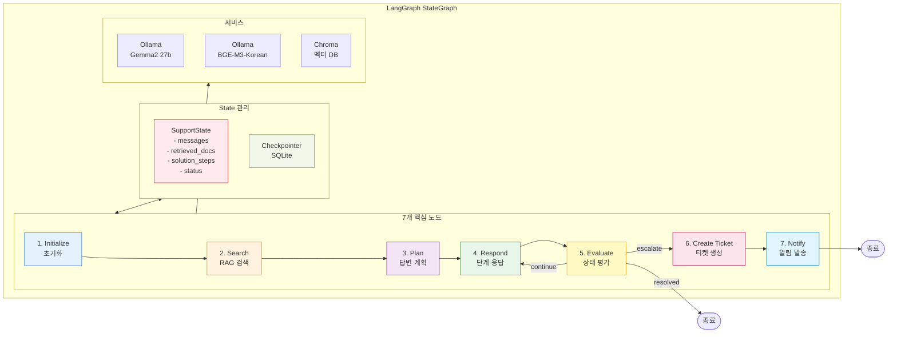
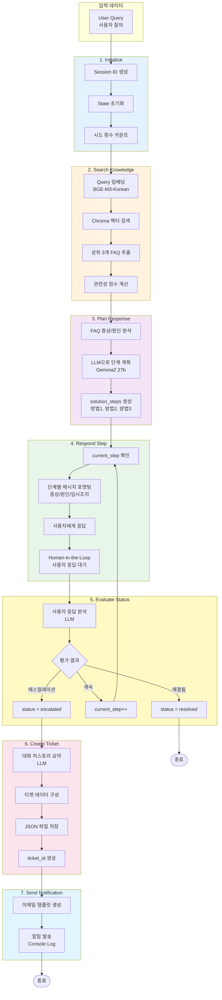
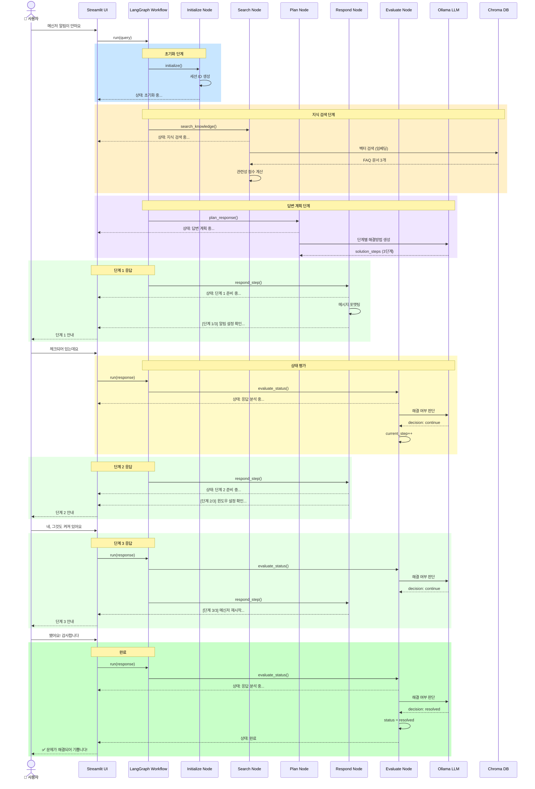
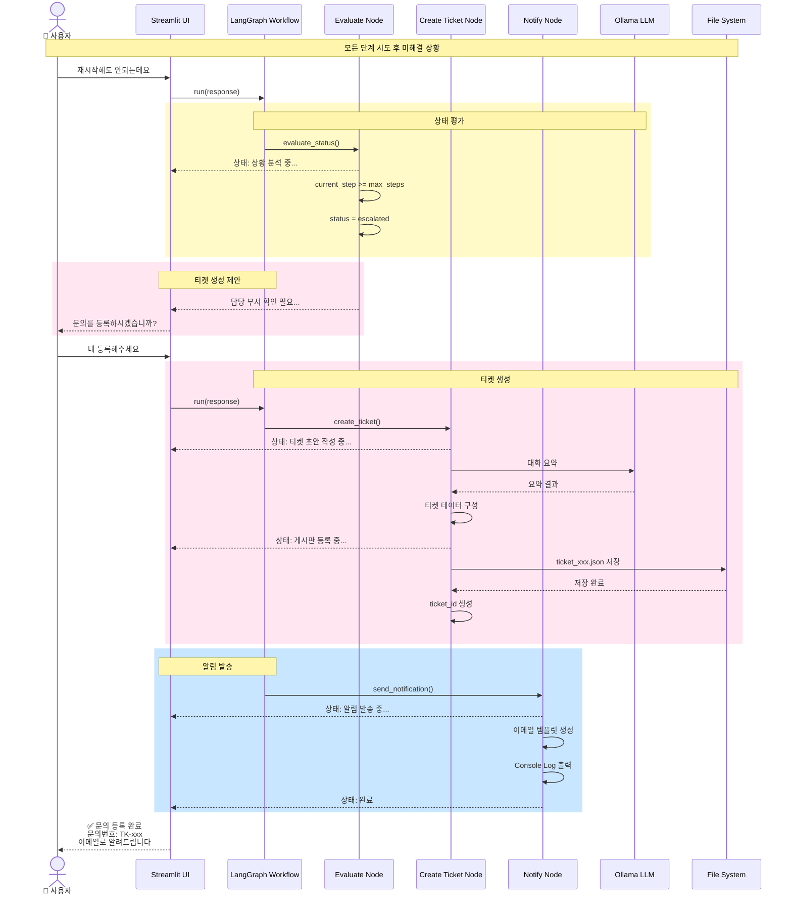
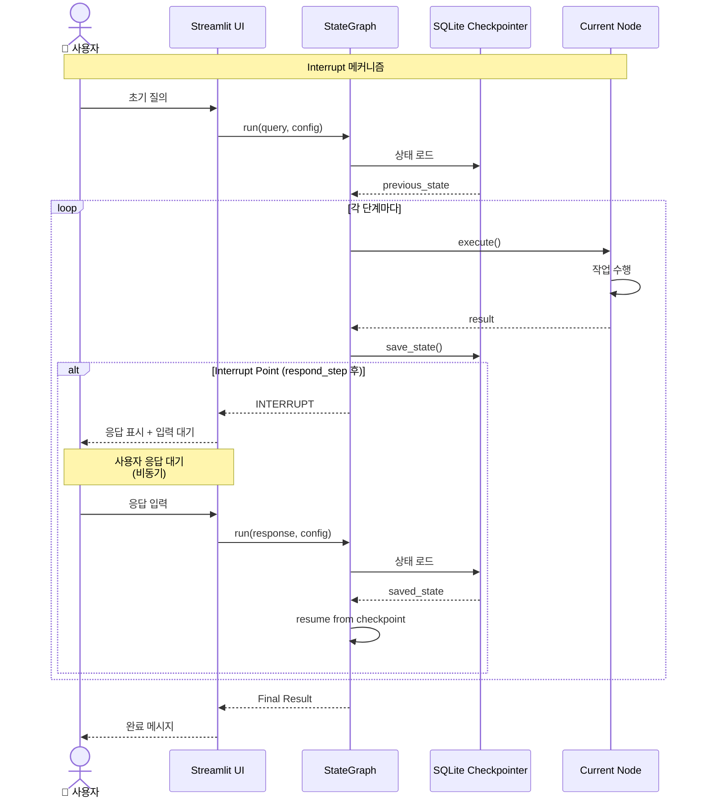
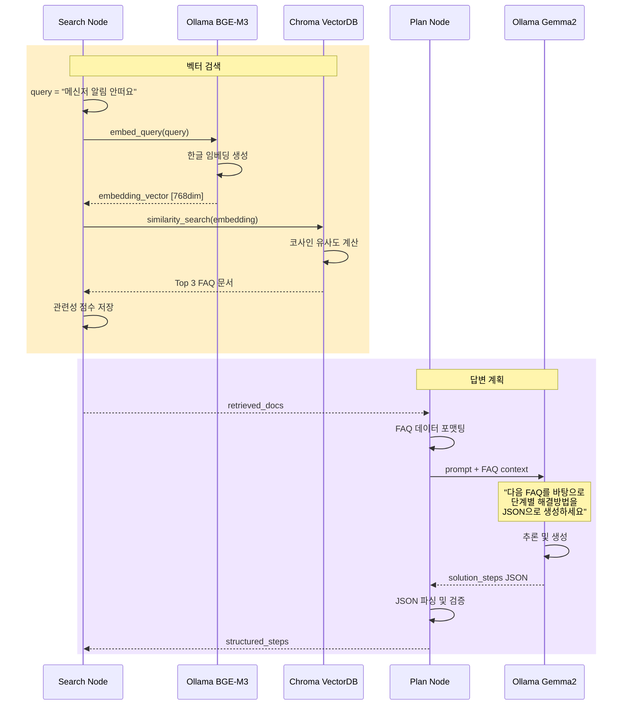
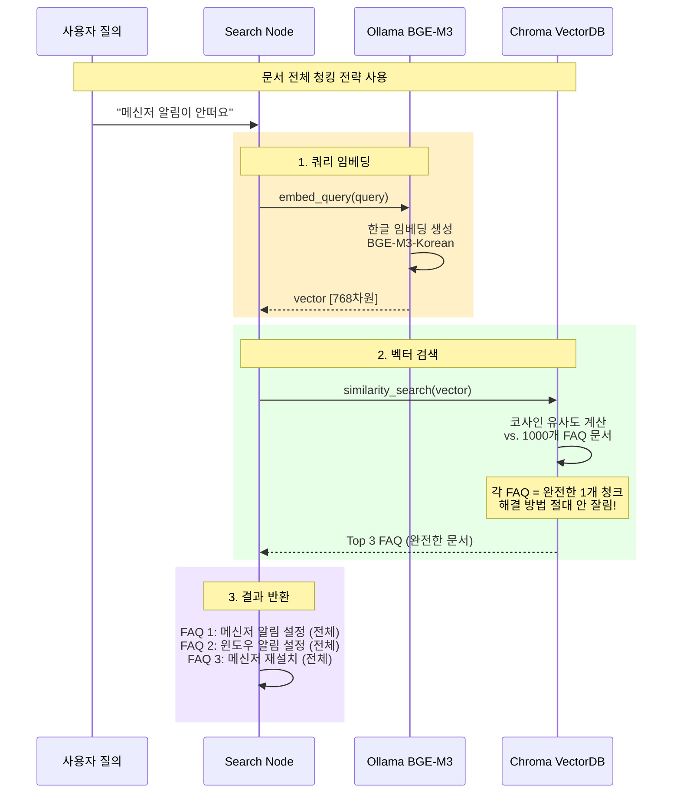

# 고객지원 챗봇 사용자 시나리오 및 워크플로우

## 📋 목차
1. [기본 시나리오](#기본-시나리오)
2. [상세 워크플로우](#상세-워크플로우)
3. [LangGraph 노드 구조](#langgraph-노드-구조)
4. [시퀀스 다이어그램](#시퀀스-다이어그램)
5. [시나리오별 분기 처리](#시나리오별-분기-처리)
6. [FAQ 데이터 구조](#faq-데이터-구조)
7. [벡터 임베딩 및 청킹 전략](#벡터-임베딩-및-청킹-전략) ⭐ NEW

---

## 기본 시나리오

### 시나리오 1: 문제 해결 성공 케이스

```
👤 사용자: 메신저에서 신착 메시지 알림이 안떠요

🤖 Agent:
   [상태: 지식 검색 중...]
   관련 FAQ를 찾았습니다. 단계별로 확인해드리겠습니다.

   [단계 1/3] 환경설정 확인
   💡 증상: 메신저 알림이 표시되지 않음
   🔍 원인: 알림 설정이 비활성화되어 있을 수 있습니다

   📝 임시조치 - 방법 1
   환경설정 > 알림 > "알림창"에 체크가 되어 있는지 확인해 주세요

   📌 기대 결과: 알림창에 체크가 되어있어야 합니다.

   이 단계를 확인하셨나요? 결과를 알려주세요.

👤 사용자: 체크되어 있는데요

🤖 Agent:
   [상태: 다음 단계 준비 중...]

   [단계 2/3] 윈도우 시스템 설정 확인

   📝 임시조치 - 방법 2
   윈도우 시작 > 설정 > 알림 및 작업 설정 >
   "앱 및 다른 보낸 사람의 알림 받기"가 켜져 있는지 확인해주세요

   📌 기대 결과: 켬 상태

   확인하셨나요?

👤 사용자: 네, 그것도 켜져 있어요

🤖 Agent:
   [상태: 다음 단계 준비 중...]

   [단계 3/3] 메신저 재시작

   📝 임시조치 - 방법 3
   메신저를 완전히 종료한 후 다시 실행해주세요
   1. 작업 표시줄에서 메신저 아이콘 우클릭
   2. "종료" 클릭
   3. 메신저 다시 실행

   📌 기대 결과: 알림이 정상적으로 표시됨

   문제가 해결되었나요?

👤 사용자: 네, 해결됐어요! 감사합니다

🤖 Agent:
   [상태: 완료]

   ✅ 문제가 해결되어 기쁩니다!
   추가로 도움이 필요하시면 언제든 문의해주세요.

   [대화 종료]
```

---

### 시나리오 2: 미해결 → 티켓 생성 케이스

```
👤 사용자: 메신저에서 신착 메시지 알림이 안떠요

🤖 Agent:
   [상태: 지식 검색 중...]
   관련 FAQ를 찾았습니다. 단계별로 확인해드리겠습니다.

   [단계 1/3] 환경설정 확인
   ...

👤 사용자: 체크되어 있는데요

🤖 Agent:
   [상태: 다음 단계 준비 중...]
   [단계 2/3] 윈도우 시스템 설정 확인
   ...

👤 사용자: 그것도 켬으로 되어 있어요

🤖 Agent:
   [상태: 다음 단계 준비 중...]
   [단계 3/3] 메신저 재시작
   ...

👤 사용자: 재시작해도 안되는데요

🤖 Agent:
   [상태: 상황 분석 중...]
   [상태: 티켓 초안 작성 중...]

   불편을 드려 죄송합니다. 😔
   제시된 모든 방법을 시도하셨는데도 문제가 해결되지 않으셨네요.
   담당 부서의 확인이 필요한 상황인 것 같습니다.

   📋 문의 내용 요약
   ━━━━━━━━━━━━━━━━━━━━━━━━━━━━
   제목: 메신저 신착 알림 미작동
   증상: 메신저에서 신착 메시지 알림이 표시되지 않음

   시도한 해결 방법:
   ✓ 방법 1: 메신저 알림 설정 확인 → 정상
   ✓ 방법 2: 윈도우 알림 설정 확인 → 정상
   ✓ 방법 3: 메신저 재시작 → 문제 지속
   ━━━━━━━━━━━━━━━━━━━━━━━━━━━━

   현재까지의 문의 내용으로 Q&A 게시판에 등록하시겠습니까?
   (등록하시면 담당자가 확인 후 답변을 드립니다)

👤 사용자: 네 등록해주세요

🤖 Agent:
   [상태: 티켓 생성 중...]
   [상태: 게시판 등록 중...]
   [상태: 알림 설정 중...]

   ✅ 아래 내용으로 문의를 등록하였습니다.

   📌 문의 번호: TK-20231118-a3f2
   📌 제목: 메신저 신착 알림 미작동
   📌 카테고리: 메신저
   📌 상태: 접수 완료

   답변이 등록되면 이메일로 알려드리겠습니다.
   등록하신 이메일: user@example.com

   평균 응답 시간: 1-2 영업일

   감사합니다! 🙏
```

---

## 상세 워크플로우

### 전체 프로세스 다이어그램


---

## LangGraph 노드 구조

### LangGraph StateGraph 아키텍처



### 노드별 책임과 데이터 흐름



---

## 시퀀스 다이어그램

### 1. 전체 시스템 상호작용 (문제 해결 성공)



### 2. 티켓 생성 시나리오



### 3. Human-in-the-Loop 상세 흐름



### 4. 벡터 검색 및 LLM 호출 흐름



---

## 시나리오별 분기 처리

### 1. 즉시 해결 (1단계에서 해결)

```
입력: "로그인이 안돼요"
  ↓
[검색] → FAQ: "로그인 실패" 찾음
  ↓
[계획] → 3가지 방법 준비
  ↓
[응답] → 방법 1 제시: "비밀번호 확인"
  ↓
[사용자] → "아, 비밀번호 틀렸었네요. 해결했어요!"
  ↓
[평가] → 해결됨 감지
  ↓
[종료] ✅
```

### 2. 중간 해결 (2-3단계에서 해결)

```
입력: "파일 업로드가 안돼요"
  ↓
[방법 1] → "파일 크기 확인" → 실패
  ↓
[방법 2] → "파일 형식 확인" → 실패
  ↓
[방법 3] → "브라우저 캐시 삭제" → 성공! ✅
  ↓
[종료]
```

### 3. 완전 미해결 (티켓 생성)

```
입력: "서버 연결이 안돼요"
  ↓
[방법 1] → 실패
  ↓
[방법 2] → 실패
  ↓
[방법 3] → 실패
  ↓
[평가] → 모든 방법 시도 완료, 미해결
  ↓
[티켓 생성 제안] → 사용자 동의
  ↓
[게시판 등록] → 티켓 번호 발급
  ↓
[알림 설정] ✉️
```

### 4. 사용자 명시적 에스컬레이션

```
입력: "문제가 복잡해요. 담당자와 통화하고 싶어요"
  ↓
[평가] → 에스컬레이션 키워드 감지
  ↓
[즉시 티켓 생성]
```

---

## FAQ 데이터 구조

### 실제 FAQ 포맷 (1000개 게시글 기준)

```json
{
  "id": "FAQ-001",
  "category": "메신저",
  "title": "신착 메시지 알림이 표시되지 않음",
  "content": {
    "symptom": "메신저에서 새로운 메시지를 받아도 알림창이 뜨지 않습니다.",
    "cause": "알림 설정이 비활성화되어 있거나, 운영체제의 알림 권한이 거부된 경우 발생할 수 있습니다.",
    "solutions": [
      {
        "method": 1,
        "title": "메신저 알림 설정 확인",
        "steps": [
          "환경설정 메뉴를 엽니다",
          "알림 탭을 선택합니다",
          "'알림창' 옵션에 체크되어 있는지 확인합니다"
        ],
        "expected_result": "알림창에 체크가 되어있어야 합니다"
      },
      {
        "method": 2,
        "title": "윈도우 알림 설정 확인",
        "steps": [
          "윈도우 시작 메뉴를 엽니다",
          "설정 > 시스템 > 알림 및 작업을 선택합니다",
          "'앱 및 다른 보낸 사람의 알림 받기'를 켜짐으로 설정합니다",
          "앱 목록에서 해당 메신저의 알림이 켜져있는지 확인합니다"
        ],
        "expected_result": "모든 알림 설정이 켜짐 상태여야 합니다"
      },
      {
        "method": 3,
        "title": "메신저 재시작",
        "steps": [
          "작업 표시줄에서 메신저 아이콘을 우클릭합니다",
          "'종료'를 선택합니다",
          "메신저를 다시 실행합니다"
        ],
        "expected_result": "재시작 후 알림이 정상적으로 표시됩니다"
      }
    ]
  },
  "tags": ["알림", "메신저", "설정"],
  "created_at": "2023-08-15",
  "updated_at": "2023-11-10",
  "view_count": 1247,
  "helpful_count": 982
}
```

### LangGraph 노드에서의 FAQ 구조 처리

FAQ 데이터 구조가 LangGraph의 각 노드에서 어떻게 처리되고 활용되는지 설명합니다.

#### 1. 검색 단계 (Search Node)

```python
# 벡터 검색 시 다음 필드들이 임베딩됨
searchable_text = f"""
카테고리: {faq['category']}
제목: {faq['title']}
증상: {faq['content']['symptom']}
원인: {faq['content']['cause']}
해결방법: {' '.join([sol['title'] for sol in faq['content']['solutions']])}
"""
```

#### 2. 계획 단계 (Plan Node)

```python
# FAQ 구조를 그대로 활용
solution_steps = []
for solution in faq['content']['solutions']:
    step = {
        "step": solution['method'],
        "title": solution['title'],
        "symptom": faq['content']['symptom'],
        "cause": faq['content']['cause'],
        "actions": solution['steps'],
        "expected_result": solution['expected_result'],
        "completed": False
    }
    solution_steps.append(step)
```

#### 3. 응답 단계 (Respond Node)

```python
# 사용자에게 제시되는 형식
response = f"""
[단계 {current_step}/{total_steps}] {step['title']}

💡 증상: {step['symptom']}
🔍 원인: {step['cause']}

📝 임시조치 - 방법 {step['step']}
{format_steps(step['actions'])}

📌 기대 결과: {step['expected_result']}

이 단계를 확인하셨나요? 결과를 알려주세요.
"""
```

---

## WebUI 상태 표시

### Streamlit 구현 예시

```python
import streamlit as st

# 진행 상태 표시 컨테이너
status_container = st.empty()
progress_bar = st.progress(0)

# 1. 초기화
with status_container:
    st.info("🔄 상태: 초기화 중...")
progress_bar.progress(10)

# 2. 검색
with status_container:
    st.info("🔍 상태: 지식 검색 중...")
progress_bar.progress(30)

# 3. 계획
with status_container:
    st.info("📋 상태: 답변 계획 중...")
progress_bar.progress(50)

# 4. 응답 준비
with status_container:
    st.info("💬 상태: 단계 1 준비 중...")
progress_bar.progress(70)

# 5. 완료
with status_container:
    st.success("✅ 상태: 답변 준비 완료")
progress_bar.progress(100)

# 실제 답변 표시
st.markdown(response_text)
```

---

## 벡터 임베딩 및 청킹 전략

### 청킹 전략의 중요성

일반 RAG 시스템에서 **청킹(Chunking)은 검색 품질을 결정하는 핵심 요소**입니다. FAQ 데이터처럼 구조화된 문서에서 잘못된 청킹은 해결 방법이 중간에 잘려 사용자에게 불완전한 정보를 제공하게 됩니다.

### 문제 상황: 잘못된 청킹

```
❌ 일반 고정 길이 청킹 (500자 단위)을 사용하면:

FAQ 원본:
┌──────────────────────────────────────┐
│ 제목: 메신저 알림 미작동             │
│ 증상: 메신저에서 새로운 메시지를...  │
│ 원인: 알림 설정이 비활성화...        │
│ 방법1: [단계1] 환경설정 열기         │
│        [단계2] 알림 탭 선택           │ ← 청크 1 여기서 끊김
│        [단계3] 알림창 체크 확인       │
│ 방법2: [단계1] 윈도우 시작            │ ← 청크 2 시작
│        [단계2] 설정 > 알림            │
│        [단계3] 켜기                   │
└──────────────────────────────────────┘

결과: 벡터 검색 시 "방법1의 앞부분만" 반환
     → 사용자가 불완전한 단계만 보게 됨!
```

### 권장 청킹 전략: 문서 전체 청킹

**PoC에서 채택한 전략**: 각 FAQ 문서를 통째로 하나의 청크로 처리

```python
# ✅ 올바른 방법: 문서 전체를 하나의 청크로

def create_faq_document(faq):
    """FAQ 전체를 하나의 완전한 문서로 임베딩"""

    # 전체 내용을 하나의 문자열로 구성
    content = f"""제목: {faq['title']}
카테고리: {faq['category']}

증상:
{faq['content']['symptom']}

원인:
{faq['content']['cause']}

해결 방법:
"""

    # 모든 해결 방법을 완전하게 포함
    for solution in faq['content']['solutions']:
        content += f"\n[방법 {solution['method']}] {solution['title']}\n"
        for i, step in enumerate(solution['steps'], 1):
            content += f"  {i}. {step}\n"
        content += f"  ▶ 기대 결과: {solution['expected_result']}\n"

    # Chroma에 저장할 Document 생성
    return Document(
        page_content=content,
        metadata={
            "id": faq["id"],
            "category": faq["category"],
            "title": faq["title"],
            "tags": faq["tags"],
            "helpful_count": faq["helpful_count"]
        }
    )
```

### 청킹 전략 장단점 비교

| 전략 | 장점 | 단점 | PoC 적합성 |
|------|------|------|-----------|
| **문서 전체** (채택) | ✅ 해결 방법 절대 안 잘림<br>✅ 구현 단순<br>✅ 맥락 완전 유지 | FAQ가 매우 긴 경우 임베딩 품질 저하 가능 | ⭐⭐⭐⭐⭐ |
| **의미 기반** (각 방법별) | ✅ 검색 정밀도 향상<br>✅ 긴 문서에 유리 | 맥락 정보 중복<br>DB 크기 증가 | ⭐⭐⭐ |
| **고정 길이** (500자) | 구현 간단 | ❌ 해결 방법 잘림<br>❌ 불완전한 정보 | ❌ 부적합 |

### 벡터 검색 흐름 (청킹 포함)



### 실제 데이터 예시

#### 원본 FAQ (JSON)

```json
{
  "id": "FAQ-001",
  "category": "메신저",
  "title": "신착 메시지 알림이 표시되지 않음",
  "content": {
    "symptom": "메신저에서 새로운 메시지를 받아도 알림창이 뜨지 않습니다.",
    "cause": "알림 설정이 비활성화되어 있거나, 운영체제의 알림 권한이 거부된 경우 발생할 수 있습니다.",
    "solutions": [
      {
        "method": 1,
        "title": "메신저 알림 설정 확인",
        "steps": [
          "환경설정 메뉴를 엽니다",
          "알림 탭을 선택합니다",
          "'알림창' 옵션에 체크되어 있는지 확인합니다"
        ],
        "expected_result": "알림창에 체크가 되어있어야 합니다"
      },
      {
        "method": 2,
        "title": "윈도우 알림 설정 확인",
        "steps": [
          "윈도우 시작 메뉴를 엽니다",
          "설정 > 시스템 > 알림 및 작업을 선택합니다",
          "'앱 및 다른 보낸 사람의 알림 받기'를 켜짐으로 설정합니다"
        ],
        "expected_result": "모든 알림 설정이 켜짐 상태여야 합니다"
      },
      {
        "method": 3,
        "title": "메신저 재시작",
        "steps": [
          "작업 표시줄에서 메신저 아이콘을 우클릭합니다",
          "'종료'를 선택합니다",
          "메신저를 다시 실행합니다"
        ],
        "expected_result": "재시작 후 알림이 정상적으로 표시됩니다"
      }
    ]
  }
}
```

#### Chroma에 저장되는 형태

```python
# Document.page_content (임베딩 대상)
"""
제목: 신착 메시지 알림이 표시되지 않음
카테고리: 메신저

증상:
메신저에서 새로운 메시지를 받아도 알림창이 뜨지 않습니다.

원인:
알림 설정이 비활성화되어 있거나, 운영체제의 알림 권한이 거부된 경우 발생할 수 있습니다.

해결 방법:

[방법 1] 메신저 알림 설정 확인
  1. 환경설정 메뉴를 엽니다
  2. 알림 탭을 선택합니다
  3. '알림창' 옵션에 체크되어 있는지 확인합니다
  ▶ 기대 결과: 알림창에 체크가 되어있어야 합니다

[방법 2] 윈도우 알림 설정 확인
  1. 윈도우 시작 메뉴를 엽니다
  2. 설정 > 시스템 > 알림 및 작업을 선택합니다
  3. '앱 및 다른 보낸 사람의 알림 받기'를 켜짐으로 설정합니다
  ▶ 기대 결과: 모든 알림 설정이 켜짐 상태여야 합니다

[방법 3] 메신저 재시작
  1. 작업 표시줄에서 메신저 아이콘을 우클릭합니다
  2. '종료'를 선택합니다
  3. 메신저를 다시 실행합니다
  ▶ 기대 결과: 재시작 후 알림이 정상적으로 표시됩니다
"""

# Document.metadata (필터링용)
{
    "id": "FAQ-001",
    "category": "메신저",
    "title": "신착 메시지 알림이 표시되지 않음",
    "tags": ["알림", "메신저", "설정"],
    "helpful_count": 982
}
```

### 메타데이터 필터링 활용

청킹과 함께 메타데이터 필터링을 사용하면 검색 정확도를 더욱 높일 수 있습니다.

```python
# 1. 카테고리 기반 필터링
results = vectorstore.similarity_search(
    query="알림이 안와요",
    k=3,
    filter={"category": "메신저"}
)

# 2. 품질 기반 필터링 (도움됨 수 높은 FAQ 우선)
results = vectorstore.similarity_search(
    query="로그인 오류",
    k=5,
    filter={"helpful_count": {"$gte": 100}}
)

# 3. 복합 필터링
results = vectorstore.similarity_search(
    query="설정 방법",
    k=3,
    filter={
        "$and": [
            {"category": {"$in": ["메신저", "알림"]}},
            {"helpful_count": {"$gte": 50}}
        ]
    }
)
```

### 청킹 품질 검증 방법

```python
def validate_chunking_completeness(vectorstore):
    """각 FAQ의 해결 방법이 완전한지 검증"""

    test_queries = [
        "메신저 알림 설정",
        "로그인 비밀번호 오류",
        "파일 업로드 실패"
    ]

    for query in test_queries:
        results = vectorstore.similarity_search(query, k=1)
        doc = results[0]

        # 해결 방법 개수와 "기대 결과" 개수가 일치하는지 확인
        method_count = doc.page_content.count("[방법")
        expected_result_count = doc.page_content.count("▶ 기대 결과:")

        if method_count == expected_result_count:
            print(f"✅ {query}: 모든 해결 방법 완전함 ({method_count}개)")
        else:
            print(f"⚠️  {query}: 불완전한 해결 방법 발견!")
            print(f"   방법 수: {method_count}, 기대 결과: {expected_result_count}")
```

### 프로덕션 고려사항

**Phase 1 (PoC - 현재)**:
- ✅ 문서 전체 청킹 사용
- FAQ 크기: 평균 1000-2000자
- 해결 방법 잘림 위험: **제로**
- 구현: 단순, 안정적

**Phase 2 (프로덕션 - 향후)**:
- 실제 데이터 분석 후 전략 재평가
- 옵션 1: Parent-Child Document 전략 (긴 문서용)
- 옵션 2: 의미 기반 청킹 (정밀 검색용)
- A/B 테스트로 검색 품질 비교
- 하이브리드 검색 (벡터 + 키워드) 도입 검토

---

## 추가 시나리오

### 시나리오 3: 관련 FAQ가 없는 경우

```
👤 사용자: 신규 기능 A는 어떻게 사용하나요?

🤖 Agent:
   [상태: 지식 검색 중...]
   [상태: 검색 완료]

   죄송합니다. 해당 질문과 관련된 FAQ를 찾을 수 없습니다.

   다음 중 선택해주세요:
   1️⃣ 질문을 다르게 표현해서 다시 시도
   2️⃣ 바로 문의 등록하기

   어떻게 도와드릴까요?
```

### 시나리오 4: 여러 카테고리 매칭

```
👤 사용자: 로그인도 안되고 알림도 안와요

🤖 Agent:
   [상태: 지식 검색 중...]

   두 가지 문제를 발견했습니다:
   1️⃣ 로그인 문제
   2️⃣ 알림 문제

   어떤 문제부터 해결하시겠습니까?
```

---

**문서 버전**: 2.0
**최종 업데이트**: 2025-11-18
**작성 목적**: 사용자 경험 설계 및 개발 가이드
