# 고객지원 챗봇 사용자 시나리오 및 워크플로우

## 📋 목차
1. [기본 시나리오](#기본-시나리오)
2. [상세 워크플로우](#상세-워크플로우)
3. [LangGraph 노드 구조](#langgraph-노드-구조)
4. [시퀀스 다이어그램](#시퀀스-다이어그램)
5. [시나리오별 분기 처리](#시나리오별-분기-처리)
6. [FAQ 데이터 구조](#faq-데이터-구조)

---

## 기본 시나리오

### 시나리오 1: 문제 해결 성공 케이스

```
👤 사용자: 메신저에서 신착 메시지 알림이 안떠요

🤖 Agent:
   [상태: 지식 검색 중...]
   관련 FAQ를 찾았습니다. 단계별로 확인해드리겠습니다.

   [단계 1/3] 환경설정 확인
   💡 증상: 메신저 알림이 표시되지 않음
   🔍 원인: 알림 설정이 비활성화되어 있을 수 있습니다

   📝 임시조치 - 방법 1
   환경설정 > 알림 > "알림창"에 체크가 되어 있는지 확인해 주세요

   📌 기대 결과: 알림창에 체크가 되어있어야 합니다.

   이 단계를 확인하셨나요? 결과를 알려주세요.

👤 사용자: 체크되어 있는데요

🤖 Agent:
   [상태: 다음 단계 준비 중...]

   [단계 2/3] 윈도우 시스템 설정 확인

   📝 임시조치 - 방법 2
   윈도우 시작 > 설정 > 알림 및 작업 설정 >
   "앱 및 다른 보낸 사람의 알림 받기"가 켜져 있는지 확인해주세요

   📌 기대 결과: 켬 상태

   확인하셨나요?

👤 사용자: 네, 그것도 켜져 있어요

🤖 Agent:
   [상태: 다음 단계 준비 중...]

   [단계 3/3] 메신저 재시작

   📝 임시조치 - 방법 3
   메신저를 완전히 종료한 후 다시 실행해주세요
   1. 작업 표시줄에서 메신저 아이콘 우클릭
   2. "종료" 클릭
   3. 메신저 다시 실행

   📌 기대 결과: 알림이 정상적으로 표시됨

   문제가 해결되었나요?

👤 사용자: 네, 해결됐어요! 감사합니다

🤖 Agent:
   [상태: 완료]

   ✅ 문제가 해결되어 기쁩니다!
   추가로 도움이 필요하시면 언제든 문의해주세요.

   [대화 종료]
```

---

### 시나리오 2: 미해결 → 티켓 생성 케이스

```
👤 사용자: 메신저에서 신착 메시지 알림이 안떠요

🤖 Agent:
   [상태: 지식 검색 중...]
   관련 FAQ를 찾았습니다. 단계별로 확인해드리겠습니다.

   [단계 1/3] 환경설정 확인
   ...

👤 사용자: 체크되어 있는데요

🤖 Agent:
   [상태: 다음 단계 준비 중...]
   [단계 2/3] 윈도우 시스템 설정 확인
   ...

👤 사용자: 그것도 켬으로 되어 있어요

🤖 Agent:
   [상태: 다음 단계 준비 중...]
   [단계 3/3] 메신저 재시작
   ...

👤 사용자: 재시작해도 안되는데요

🤖 Agent:
   [상태: 상황 분석 중...]
   [상태: 티켓 초안 작성 중...]

   불편을 드려 죄송합니다. 😔
   제시된 모든 방법을 시도하셨는데도 문제가 해결되지 않으셨네요.
   담당 부서의 확인이 필요한 상황인 것 같습니다.

   📋 문의 내용 요약
   ━━━━━━━━━━━━━━━━━━━━━━━━━━━━
   제목: 메신저 신착 알림 미작동
   증상: 메신저에서 신착 메시지 알림이 표시되지 않음

   시도한 해결 방법:
   ✓ 방법 1: 메신저 알림 설정 확인 → 정상
   ✓ 방법 2: 윈도우 알림 설정 확인 → 정상
   ✓ 방법 3: 메신저 재시작 → 문제 지속
   ━━━━━━━━━━━━━━━━━━━━━━━━━━━━

   현재까지의 문의 내용으로 Q&A 게시판에 등록하시겠습니까?
   (등록하시면 담당자가 확인 후 답변을 드립니다)

👤 사용자: 네 등록해주세요

🤖 Agent:
   [상태: 티켓 생성 중...]
   [상태: 게시판 등록 중...]
   [상태: 알림 설정 중...]

   ✅ 아래 내용으로 문의를 등록하였습니다.

   📌 문의 번호: TK-20231118-a3f2
   📌 제목: 메신저 신착 알림 미작동
   📌 카테고리: 메신저
   📌 상태: 접수 완료

   답변이 등록되면 이메일로 알려드리겠습니다.
   등록하신 이메일: user@example.com

   평균 응답 시간: 1-2 영업일

   감사합니다! 🙏
```

---

## 상세 워크플로우

### 전체 프로세스 다이어그램

```mermaid
graph TD
    Start([사용자 질의 입력]) --> ShowStatus1[상태: 초기화 중...]
    ShowStatus1 --> Initialize[초기화<br/>세션 생성]

    Initialize --> ShowStatus2[상태: 지식 검색 중...]
    ShowStatus2 --> Search[RAG 검색<br/>FAQ 벡터 검색]

    Search --> ShowStatus3[상태: 답변 계획 중...]
    ShowStatus3 --> Plan[답변 계획<br/>단계별 해결방법 추출]

    Plan --> ShowStatus4[상태: 단계 1 준비 중...]
    ShowStatus4 --> Respond[단계별 응답<br/>증상/원인/임시조치 제시]

    Respond --> UserWait{{사용자 응답 대기}}

    UserWait --> ShowStatus5[상태: 응답 분석 중...]
    ShowStatus5 --> Evaluate{상태 평가}

    Evaluate -->|해결됨| ShowStatus6[상태: 완료]
    ShowStatus6 --> Resolved([대화 종료<br/>문제 해결])

    Evaluate -->|다음 단계| NextStep{남은 단계?}
    NextStep -->|있음| ShowStatus4
    NextStep -->|없음| ShowStatus7[상태: 티켓 초안 작성 중...]

    Evaluate -->|에스컬레이션| ShowStatus7

    ShowStatus7 --> CreateTicket[티켓 생성<br/>대화 요약]
    CreateTicket --> ShowStatus8[상태: 게시판 등록 중...]
    ShowStatus8 --> SaveTicket[게시판 저장]
    SaveTicket --> ShowStatus9[상태: 알림 발송 중...]
    ShowStatus9 --> Notify[알림 발송]
    Notify --> End([워크플로우 종료])

    style Start fill:#4CAF50,color:#fff
    style ShowStatus1 fill:#FFA726,color:#fff
    style ShowStatus2 fill:#FFA726,color:#fff
    style ShowStatus3 fill:#FFA726,color:#fff
    style ShowStatus4 fill:#FFA726,color:#fff
    style ShowStatus5 fill:#FFA726,color:#fff
    style ShowStatus6 fill:#FFA726,color:#fff
    style ShowStatus7 fill:#FFA726,color:#fff
    style ShowStatus8 fill:#FFA726,color:#fff
    style ShowStatus9 fill:#FFA726,color:#fff
    style UserWait fill:#F44336,color:#fff
    style Resolved fill:#4CAF50,color:#fff
    style End fill:#607D8B,color:#fff
```



---

## LangGraph 노드 구조

### LangGraph StateGraph 아키텍처

```mermaid
graph LR
    subgraph LangGraph["LangGraph StateGraph"]
        subgraph Nodes["7개 핵심 노드"]
            N1[1. Initialize<br/>초기화]
            N2[2. Search<br/>RAG 검색]
            N3[3. Plan<br/>답변 계획]
            N4[4. Respond<br/>단계 응답]
            N5[5. Evaluate<br/>상태 평가]
            N6[6. Create Ticket<br/>티켓 생성]
            N7[7. Notify<br/>알림 발송]
        end

        subgraph State["State 관리"]
            S1[SupportState<br/>- messages<br/>- retrieved_docs<br/>- solution_steps<br/>- status]
            S2[Checkpointer<br/>SQLite]
        end

        subgraph Services["서비스"]
            SV1[Ollama<br/>Gemma2 27b]
            SV2[Ollama<br/>BGE-M3-Korean]
            SV3[Chroma<br/>벡터 DB]
        end
    end

    N1 --> N2
    N2 --> N3
    N3 --> N4
    N4 --> N5
    N5 -->|continue| N4
    N5 -->|resolved| END1([종료])
    N5 -->|escalate| N6
    N6 --> N7
    N7 --> END2([종료])

    Nodes <--> State
    Nodes --> Services

    style N1 fill:#E3F2FD,stroke:#1976D2
    style N2 fill:#FFF3E0,stroke:#F57C00
    style N3 fill:#F3E5F5,stroke:#7B1FA2
    style N4 fill:#E8F5E9,stroke:#388E3C
    style N5 fill:#FFF9C4,stroke:#F9A825
    style N6 fill:#FCE4EC,stroke:#C2185B
    style N7 fill:#E1F5FE,stroke:#0288D1
    style S1 fill:#FFEBEE,stroke:#D32F2F
    style S2 fill:#F1F8E9,stroke:#689F38
```



### 노드별 책임과 데이터 흐름

```mermaid
graph TD
    subgraph Input["입력 데이터"]
        I1[User Query<br/>사용자 질의]
    end

    subgraph Node1["1. Initialize"]
        I1 --> A1[Session ID 생성]
        A1 --> A2[State 초기화]
        A2 --> A3[시도 횟수 카운트]
    end

    subgraph Node2["2. Search Knowledge"]
        A3 --> B1[Query 임베딩<br/>BGE-M3-Korean]
        B1 --> B2[Chroma 벡터 검색]
        B2 --> B3[상위 3개 FAQ 추출]
        B3 --> B4[관련성 점수 계산]
    end

    subgraph Node3["3. Plan Response"]
        B4 --> C1[FAQ 증상/원인 분석]
        C1 --> C2[LLM으로 단계 계획<br/>Gemma2 27b]
        C2 --> C3[solution_steps 생성<br/>방법1, 방법2, 방법3]
    end

    subgraph Node4["4. Respond Step"]
        C3 --> D1[current_step 확인]
        D1 --> D2[단계별 메시지 포맷팅<br/>증상/원인/임시조치]
        D2 --> D3[사용자에게 응답]
        D3 --> D4[Human-in-the-Loop<br/>사용자 응답 대기]
    end

    subgraph Node5["5. Evaluate Status"]
        D4 --> E1[사용자 응답 분석<br/>LLM]
        E1 --> E2{평가 결과}
        E2 -->|해결됨| E3[status = resolved]
        E2 -->|계속| E4[current_step++]
        E2 -->|에스컬레이션| E5[status = escalated]
    end

    subgraph Node6["6. Create Ticket"]
        E5 --> F1[대화 히스토리 요약<br/>LLM]
        F1 --> F2[티켓 데이터 구성]
        F2 --> F3[JSON 파일 저장]
        F3 --> F4[ticket_id 생성]
    end

    subgraph Node7["7. Send Notification"]
        F4 --> G1[이메일 템플릿 생성]
        G1 --> G2[알림 발송<br/>Console Log]
    end

    E3 --> Output1([종료])
    E4 --> D1
    G2 --> Output2([종료])

    style Node1 fill:#E3F2FD
    style Node2 fill:#FFF3E0
    style Node3 fill:#F3E5F5
    style Node4 fill:#E8F5E9
    style Node5 fill:#FFF9C4
    style Node6 fill:#FCE4EC
    style Node7 fill:#E1F5FE
```



---

## 시퀀스 다이어그램

### 1. 전체 시스템 상호작용 (문제 해결 성공)

```mermaid
sequenceDiagram
    actor User as 👤 사용자
    participant UI as Streamlit UI
    participant WF as LangGraph Workflow
    participant Init as Initialize Node
    participant Search as Search Node
    participant Plan as Plan Node
    participant Respond as Respond Node
    participant Eval as Evaluate Node
    participant Ollama as Ollama LLM
    participant Chroma as Chroma DB

    User->>UI: 메신저 알림이 안떠요
    UI->>WF: run(query)

    rect rgb(200, 230, 255)
        Note over WF,Init: 초기화 단계
        WF->>Init: initialize()
        Init->>Init: 세션 ID 생성
        Init-->>UI: 상태: 초기화 중...
    end

    rect rgb(255, 240, 200)
        Note over WF,Chroma: 지식 검색 단계
        WF->>Search: search_knowledge()
        Search-->>UI: 상태: 지식 검색 중...
        Search->>Chroma: 벡터 검색 (임베딩)
        Chroma-->>Search: FAQ 문서 3개
        Search->>Search: 관련성 점수 계산
    end

    rect rgb(240, 230, 255)
        Note over WF,Ollama: 답변 계획 단계
        WF->>Plan: plan_response()
        Plan-->>UI: 상태: 답변 계획 중...
        Plan->>Ollama: 단계별 해결방법 생성
        Ollama-->>Plan: solution_steps (3단계)
    end

    rect rgb(230, 255, 230)
        Note over WF,UI: 단계 1 응답
        WF->>Respond: respond_step()
        Respond-->>UI: 상태: 단계 1 준비 중...
        Respond->>Respond: 메시지 포맷팅
        Respond-->>UI: [단계 1/3] 알림 설정 확인...
        UI-->>User: 단계 1 안내
    end

    User->>UI: 체크되어 있는데요

    rect rgb(255, 250, 200)
        Note over WF,Ollama: 상태 평가
        UI->>WF: run(response)
        WF->>Eval: evaluate_status()
        Eval-->>UI: 상태: 응답 분석 중...
        Eval->>Ollama: 해결 여부 판단
        Ollama-->>Eval: decision: continue
        Eval->>Eval: current_step++
    end

    rect rgb(230, 255, 230)
        Note over WF,UI: 단계 2 응답
        WF->>Respond: respond_step()
        Respond-->>UI: 상태: 단계 2 준비 중...
        Respond-->>UI: [단계 2/3] 윈도우 설정 확인...
        UI-->>User: 단계 2 안내
    end

    User->>UI: 네, 그것도 켜져 있어요

    rect rgb(230, 255, 230)
        Note over WF,UI: 단계 3 응답
        UI->>WF: run(response)
        WF->>Eval: evaluate_status()
        Eval->>Ollama: 해결 여부 판단
        Ollama-->>Eval: decision: continue
        WF->>Respond: respond_step()
        Respond-->>UI: [단계 3/3] 메신저 재시작...
        UI-->>User: 단계 3 안내
    end

    User->>UI: 됐어요! 감사합니다

    rect rgb(200, 255, 200)
        Note over WF,UI: 완료
        UI->>WF: run(response)
        WF->>Eval: evaluate_status()
        Eval-->>UI: 상태: 응답 분석 중...
        Eval->>Ollama: 해결 여부 판단
        Ollama-->>Eval: decision: resolved
        Eval->>Eval: status = resolved
        Eval-->>UI: 상태: 완료
        UI-->>User: ✅ 문제가 해결되어 기쁩니다!
    end
```



### 2. 티켓 생성 시나리오

```mermaid
sequenceDiagram
    actor User as 👤 사용자
    participant UI as Streamlit UI
    participant WF as LangGraph Workflow
    participant Eval as Evaluate Node
    participant Ticket as Create Ticket Node
    participant Notify as Notify Node
    participant Ollama as Ollama LLM
    participant FS as File System

    Note over User,FS: 모든 단계 시도 후 미해결 상황

    User->>UI: 재시작해도 안되는데요
    UI->>WF: run(response)

    rect rgb(255, 250, 200)
        Note over WF,Ollama: 상태 평가
        WF->>Eval: evaluate_status()
        Eval-->>UI: 상태: 상황 분석 중...
        Eval->>Eval: current_step >= max_steps
        Eval->>Eval: status = escalated
    end

    rect rgb(255, 230, 240)
        Note over WF,UI: 티켓 생성 제안
        Eval-->>UI: 담당 부서 확인 필요...
        UI-->>User: 문의를 등록하시겠습니까?
    end

    User->>UI: 네 등록해주세요

    rect rgb(255, 230, 240)
        Note over WF,FS: 티켓 생성
        UI->>WF: run(response)
        WF->>Ticket: create_ticket()
        Ticket-->>UI: 상태: 티켓 초안 작성 중...
        Ticket->>Ollama: 대화 요약
        Ollama-->>Ticket: 요약 결과
        Ticket->>Ticket: 티켓 데이터 구성
        Ticket-->>UI: 상태: 게시판 등록 중...
        Ticket->>FS: ticket_xxx.json 저장
        FS-->>Ticket: 저장 완료
        Ticket->>Ticket: ticket_id 생성
    end

    rect rgb(200, 230, 255)
        Note over WF,UI: 알림 발송
        WF->>Notify: send_notification()
        Notify-->>UI: 상태: 알림 발송 중...
        Notify->>Notify: 이메일 템플릿 생성
        Notify->>Notify: Console Log 출력
        Notify-->>UI: 상태: 완료
    end

    UI-->>User: ✅ 문의 등록 완료<br/>문의번호: TK-xxx<br/>이메일로 알려드립니다
```



### 3. Human-in-the-Loop 상세 흐름

```mermaid
sequenceDiagram
    actor User as 👤 사용자
    participant UI as Streamlit UI
    participant Graph as StateGraph
    participant Checkpoint as SQLite Checkpointer
    participant Node as Current Node

    Note over User,Node: Interrupt 메커니즘

    User->>UI: 초기 질의
    UI->>Graph: run(query, config)
    Graph->>Checkpoint: 상태 로드
    Checkpoint-->>Graph: previous_state

    loop 각 단계마다
        Graph->>Node: execute()
        Node->>Node: 작업 수행
        Node-->>Graph: result
        Graph->>Checkpoint: save_state()

        alt Interrupt Point (respond_step 후)
            Graph-->>UI: INTERRUPT
            UI-->>User: 응답 표시 + 입력 대기
            Note over UI,User: 사용자 응답 대기<br/>(비동기)
            User->>UI: 응답 입력
            UI->>Graph: run(response, config)
            Graph->>Checkpoint: 상태 로드
            Checkpoint-->>Graph: saved_state
            Graph->>Graph: resume from checkpoint
        end
    end

    Graph-->>UI: Final Result
    UI-->>User: 완료 메시지
```



### 4. 벡터 검색 및 LLM 호출 흐름

```mermaid
sequenceDiagram
    participant Search as Search Node
    participant Embedder as Ollama BGE-M3
    participant Chroma as Chroma VectorDB
    participant Plan as Plan Node
    participant LLM as Ollama Gemma2

    rect rgb(255, 240, 200)
        Note over Search,Chroma: 벡터 검색
        Search->>Search: query = "메신저 알림 안떠요"
        Search->>Embedder: embed_query(query)
        Embedder->>Embedder: 한글 임베딩 생성
        Embedder-->>Search: embedding_vector [768dim]
        Search->>Chroma: similarity_search(embedding)
        Chroma->>Chroma: 코사인 유사도 계산
        Chroma-->>Search: Top 3 FAQ 문서
        Search->>Search: 관련성 점수 저장
    end

    rect rgb(240, 230, 255)
        Note over Plan,LLM: 답변 계획
        Search-->>Plan: retrieved_docs
        Plan->>Plan: FAQ 데이터 포맷팅
        Plan->>LLM: prompt + FAQ context
        Note over LLM: "다음 FAQ를 바탕으로<br/>단계별 해결방법을<br/>JSON으로 생성하세요"
        LLM->>LLM: 추론 및 생성
        LLM-->>Plan: solution_steps JSON
        Plan->>Plan: JSON 파싱 및 검증
        Plan-->>Search: structured_steps
    end
```



---

## 시나리오별 분기 처리

### 1. 즉시 해결 (1단계에서 해결)

```
입력: "로그인이 안돼요"
  ↓
[검색] → FAQ: "로그인 실패" 찾음
  ↓
[계획] → 3가지 방법 준비
  ↓
[응답] → 방법 1 제시: "비밀번호 확인"
  ↓
[사용자] → "아, 비밀번호 틀렸었네요. 해결했어요!"
  ↓
[평가] → 해결됨 감지
  ↓
[종료] ✅
```

### 2. 중간 해결 (2-3단계에서 해결)

```
입력: "파일 업로드가 안돼요"
  ↓
[방법 1] → "파일 크기 확인" → 실패
  ↓
[방법 2] → "파일 형식 확인" → 실패
  ↓
[방법 3] → "브라우저 캐시 삭제" → 성공! ✅
  ↓
[종료]
```

### 3. 완전 미해결 (티켓 생성)

```
입력: "서버 연결이 안돼요"
  ↓
[방법 1] → 실패
  ↓
[방법 2] → 실패
  ↓
[방법 3] → 실패
  ↓
[평가] → 모든 방법 시도 완료, 미해결
  ↓
[티켓 생성 제안] → 사용자 동의
  ↓
[게시판 등록] → 티켓 번호 발급
  ↓
[알림 설정] ✉️
```

### 4. 사용자 명시적 에스컬레이션

```
입력: "문제가 복잡해요. 담당자와 통화하고 싶어요"
  ↓
[평가] → 에스컬레이션 키워드 감지
  ↓
[즉시 티켓 생성]
```

---

## FAQ 데이터 구조

### 실제 FAQ 포맷 (1000개 게시글 기준)

```json
{
  "id": "FAQ-001",
  "category": "메신저",
  "title": "신착 메시지 알림이 표시되지 않음",
  "content": {
    "symptom": "메신저에서 새로운 메시지를 받아도 알림창이 뜨지 않습니다.",
    "cause": "알림 설정이 비활성화되어 있거나, 운영체제의 알림 권한이 거부된 경우 발생할 수 있습니다.",
    "solutions": [
      {
        "method": 1,
        "title": "메신저 알림 설정 확인",
        "steps": [
          "환경설정 메뉴를 엽니다",
          "알림 탭을 선택합니다",
          "'알림창' 옵션에 체크되어 있는지 확인합니다"
        ],
        "expected_result": "알림창에 체크가 되어있어야 합니다"
      },
      {
        "method": 2,
        "title": "윈도우 알림 설정 확인",
        "steps": [
          "윈도우 시작 메뉴를 엽니다",
          "설정 > 시스템 > 알림 및 작업을 선택합니다",
          "'앱 및 다른 보낸 사람의 알림 받기'를 켜짐으로 설정합니다",
          "앱 목록에서 해당 메신저의 알림이 켜져있는지 확인합니다"
        ],
        "expected_result": "모든 알림 설정이 켜짐 상태여야 합니다"
      },
      {
        "method": 3,
        "title": "메신저 재시작",
        "steps": [
          "작업 표시줄에서 메신저 아이콘을 우클릭합니다",
          "'종료'를 선택합니다",
          "메신저를 다시 실행합니다"
        ],
        "expected_result": "재시작 후 알림이 정상적으로 표시됩니다"
      }
    ]
  },
  "tags": ["알림", "메신저", "설정"],
  "created_at": "2023-08-15",
  "updated_at": "2023-11-10",
  "view_count": 1247,
  "helpful_count": 982
}
```

### Graph 설계에 반영된 FAQ 구조

#### 1. 검색 단계 (Search Node)

```python
# 벡터 검색 시 다음 필드들이 임베딩됨
searchable_text = f"""
카테고리: {faq['category']}
제목: {faq['title']}
증상: {faq['content']['symptom']}
원인: {faq['content']['cause']}
해결방법: {' '.join([sol['title'] for sol in faq['content']['solutions']])}
"""
```

#### 2. 계획 단계 (Plan Node)

```python
# FAQ 구조를 그대로 활용
solution_steps = []
for solution in faq['content']['solutions']:
    step = {
        "step": solution['method'],
        "title": solution['title'],
        "symptom": faq['content']['symptom'],
        "cause": faq['content']['cause'],
        "actions": solution['steps'],
        "expected_result": solution['expected_result'],
        "completed": False
    }
    solution_steps.append(step)
```

#### 3. 응답 단계 (Respond Node)

```python
# 사용자에게 제시되는 형식
response = f"""
[단계 {current_step}/{total_steps}] {step['title']}

💡 증상: {step['symptom']}
🔍 원인: {step['cause']}

📝 임시조치 - 방법 {step['step']}
{format_steps(step['actions'])}

📌 기대 결과: {step['expected_result']}

이 단계를 확인하셨나요? 결과를 알려주세요.
"""
```

---

## WebUI 상태 표시

### Streamlit 구현 예시

```python
import streamlit as st

# 진행 상태 표시 컨테이너
status_container = st.empty()
progress_bar = st.progress(0)

# 1. 초기화
with status_container:
    st.info("🔄 상태: 초기화 중...")
progress_bar.progress(10)

# 2. 검색
with status_container:
    st.info("🔍 상태: 지식 검색 중...")
progress_bar.progress(30)

# 3. 계획
with status_container:
    st.info("📋 상태: 답변 계획 중...")
progress_bar.progress(50)

# 4. 응답 준비
with status_container:
    st.info("💬 상태: 단계 1 준비 중...")
progress_bar.progress(70)

# 5. 완료
with status_container:
    st.success("✅ 상태: 답변 준비 완료")
progress_bar.progress(100)

# 실제 답변 표시
st.markdown(response_text)
```

---

## 추가 시나리오

### 시나리오 3: 관련 FAQ가 없는 경우

```
👤 사용자: 신규 기능 A는 어떻게 사용하나요?

🤖 Agent:
   [상태: 지식 검색 중...]
   [상태: 검색 완료]

   죄송합니다. 해당 질문과 관련된 FAQ를 찾을 수 없습니다.

   다음 중 선택해주세요:
   1️⃣ 질문을 다르게 표현해서 다시 시도
   2️⃣ 바로 문의 등록하기

   어떻게 도와드릴까요?
```

### 시나리오 4: 여러 카테고리 매칭

```
👤 사용자: 로그인도 안되고 알림도 안와요

🤖 Agent:
   [상태: 지식 검색 중...]

   두 가지 문제를 발견했습니다:
   1️⃣ 로그인 문제
   2️⃣ 알림 문제

   어떤 문제부터 해결하시겠습니까?
```

---

**문서 버전**: 2.0
**최종 업데이트**: 2025-11-18
**작성 목적**: 사용자 경험 설계 및 개발 가이드
